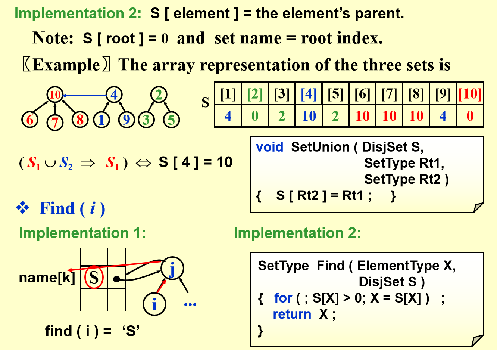
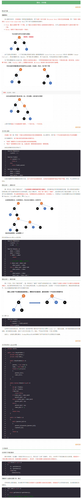
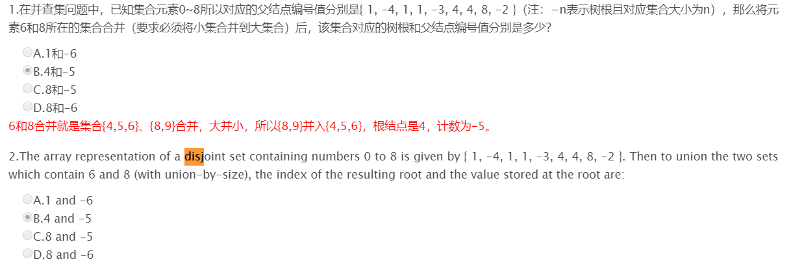
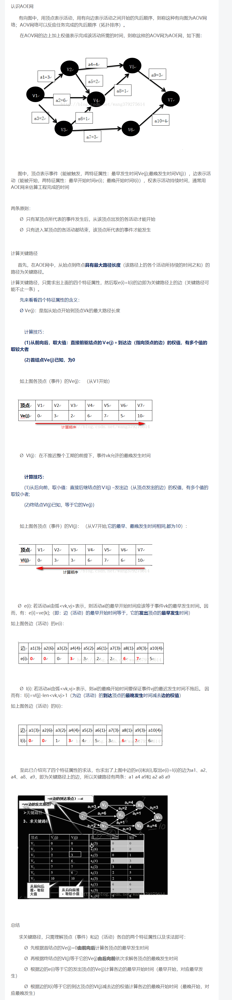
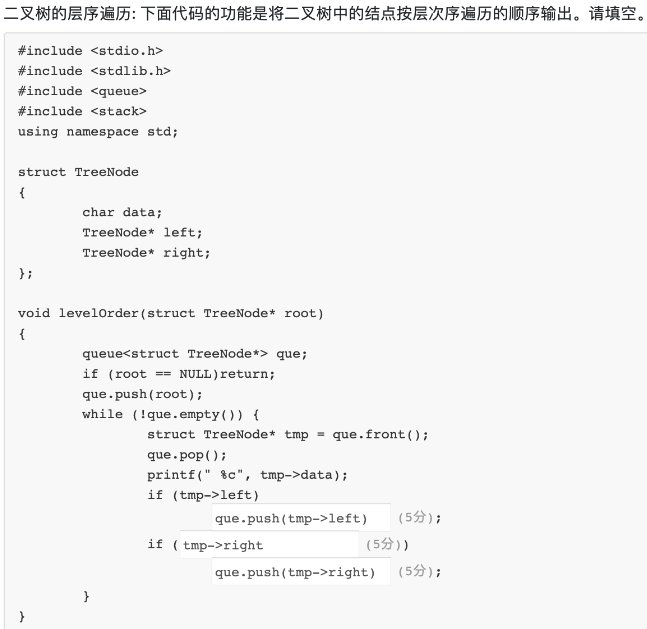
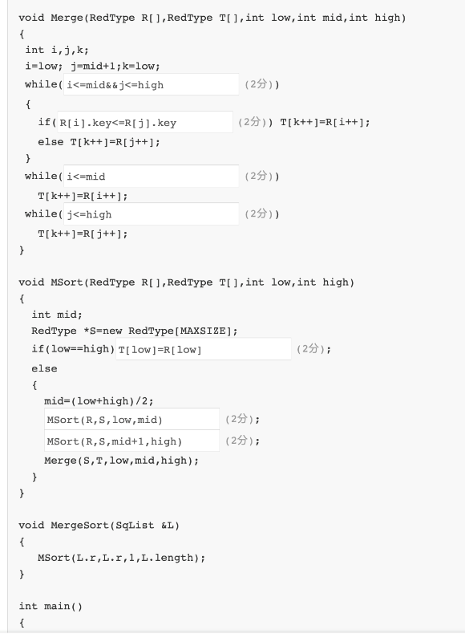
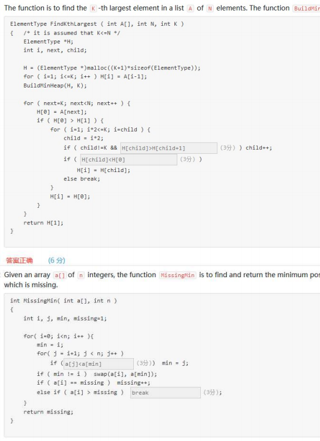
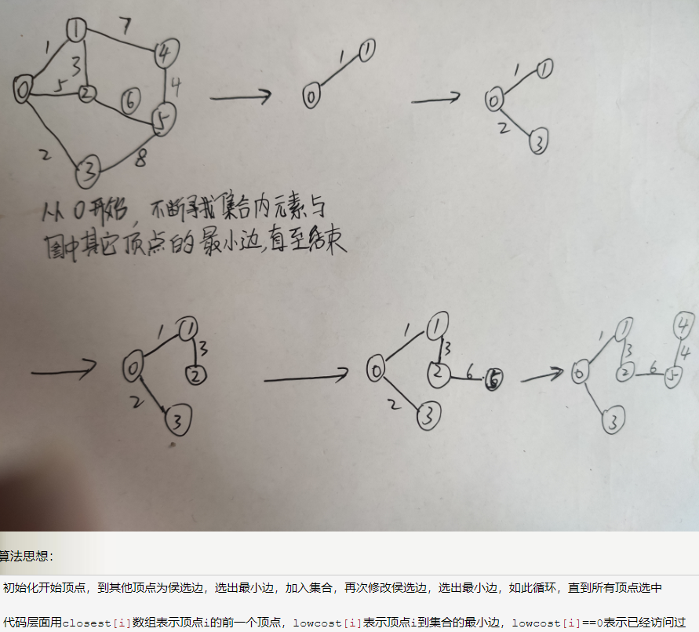
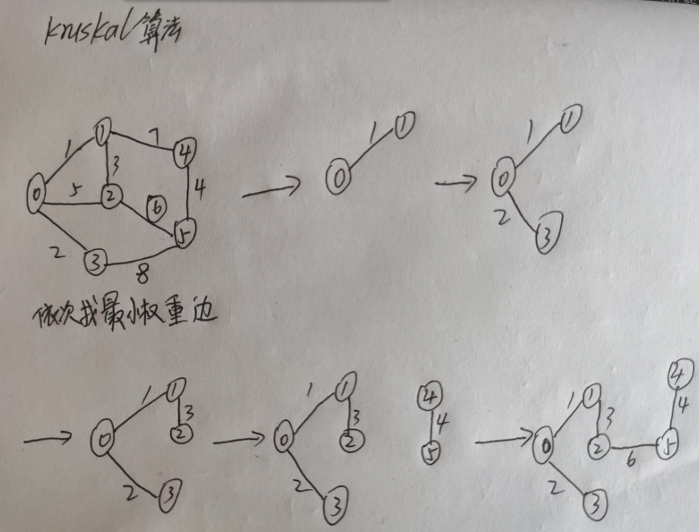

# ds补天

[TOC]

## 判断
### 1-1 一个序列的进栈顺序为abcde，那么不可能的出栈顺序为（ C）

- A. dcbae       B. abcde          C. adbec          D. edcba
- 分析：abcde的进栈顺序并不是一次性的按照abcde入栈，也可能是先入栈一部分再出栈一部分在进行入栈，整体的入栈顺序是不变的依然是abcde。
- A选项分析，可以是先入栈abcd，再出栈dbca，再入栈e，再出栈e的步骤进行入栈出栈操作。所以不可能的顺序是选项C。
- 出栈的元素顺序遵守的规律如下：**在原序列中相对位置比它靠前的，也就是比它先入栈的，出栈顺序必须是逆序**；以选项中出栈的第一个元素为基准，判断它后面的元素是否满足上述规律。

### ==1-2 排序(Sort)==

> 仅基于比较的算法能得到的最好的“最好时间复杂度”是O(N)，仅基于比较的算法能得到的最好的“最坏时间复杂度”是O(NlogN)


- **选择排序 selection sort** 

  > 从小到大 每次查找最小数据 将一个数据放在最终位置
  >
  > **O(n2)**
  >
  > 比较交换操作n*(n-1)/2 **不稳定**（相同元素次序改变）

- **冒泡排序 bubble sort** 

  > 相邻元素 小数上冒 大数下沉 n-1次排序 每一轮最大一个元素在其最终位置 
  >
  > **O(n2)** 
  >
  > 最坏情况比较次数n*(n-1)/2

- **插入排序 insertion sort** 

  > 从第二个元素开始往里插入并排序（可以通过线性查找、二分查找）
  >
  > **O(n2)**
  >
  > **稳定**排序

- **归并排序 merge sort** 

  > 均分为两个子数组 分别递归再合并 
  >
  > **O(nlogn)**
  >
  > 是**稳定**的，因为在合并的时候，如果相等，选择前面的元素到辅助数组

  ------

- ==**快排 quick sort**== 平均效率==nlogn== 最坏n2 原地排序 不需要额外的存储空间 比合并排序好

  > 分而治之 选取首元素作为pivot 比较次数O(n2)
  >
  > 
  >
  > D？？？
  >
  > 
  >
  > A 28 . 72 
  > B 2 72
  > C 2 28
  > D 12 32 
  > 两次run有3个达到最终位置或者 （2个达到且其中1个为最值）
  > 为什么其中一个是要求是最值呢？
  > 如果第一次 选中的pivot是最值 那么第二次run只能复位1个
  >
  > Pivot = median ( left, center, right )
  >
  > 
  >
  > Quicksort is slower than insertion sort for small N (  20 )
  >
  > 

- **堆排序 heap sort** 二叉堆 O( 堆的高度 ) = O( log N )

  > **不稳定**，因为没有规定相同的元素应该放在左子树还是右子树
  >
  > 最坏情况下时间复杂度O(NlogN)，堆元素下滤都从顶部下滤到底部，为logN，一共N个元素
  >
  > 因为堆排序是就地排序，空间复杂度为常数：O(1)

- **希尔排序 Shell sort** **O(n2)**

  > **不稳定**
  >
  > 
  >
  > 
  >
  > 
  >
  > 多次插入排序 步长不一样
  >
  > 

- **桶排序 bucket sort** 

  > O(n)

- **外部排序 radix sort**

- 内排序

  > 完全在内存中存放待排序元素

### 1-3 欧拉回路Euler Circuit
- 一个图每个点的度数都是偶数，或奇数度顶点的个数有且只有两个，则存在一笔画的方法。（每条**边**（而不是顶点）只经过一次）

### 1-4 散列hash

- Linear probing is equivalent to double hashing with a secondary hash function of $Hash_2(k)=1$

  > 装填因子(load factor)$\lambda$：散列表中的元素个数与散列表大小的比值

- 分离链接法(separate chaining)

  > 将散列到同一个值的所有元素保留到一个表中
  >
  > 若*N*个关键词被散列映射到同一个单元，并且用分离链接法解决冲突，则找到这*N*个关键词所用的比较次数为：N(N+1)/2
  >
  > 

- 开放定址法(open address)

  $h_i(X)=(Hash(X)+F(i))mod\; TableSize$ 其中F(0)=0

  - 线性探测法 linear probing
    
  	> $F(i)=i$
    >
    > 
    
  - 平方探测法 quadratic probing

    > $F(i)=i^2$
    >
    > 如果使用平方探测，且表的大小是素数，那么当表至少有一半是空的时候，总能够插入一个新的元素。
    >
    > 
    >
    > 49和89冲突时，下一个空闲位置是0号单元。58和18冲突时，i=1也冲突，再试i=2，h2(58)=(8+4)%10=2是空的可以放。69同理。
    >
    > If the hash values of *n* keys are all the same, and linear probing is used to resolve collisions, then the minimum total number of probings must be __ to insert these *n* keys 
    >
    > n(n+1)/2?

  - 双散列 double hashing

    > $F(i)=i\cdot hash_2(X)$
    >
    > 

- 再散列 rehashing

  > 

- 可扩散列 extendible hashing

### 1-5 时间复杂度

- $logN^{20}$ is $O(N)$

- logN属于O(N)

- Fibonacci 数列 $F_0=0,F_1=1,F_N=F_{N-1}+F_{N-2},N=2,3,...$ 计算$F_N$

|            | 递归   | 循环 | 尾循环 |
| ---------- | ------ | ---- | ------ |
| 时间复杂度 | O(2^N) | O(N) | O(N)   |
| 空间复杂度 | O(1)   | O(1) | O(N)   |

- the lowest upper bound of the time complexity is $O(N^4)$

  else时，注意一层循环跟二层循环：进不了二层循环就是N^2，能进的话一二层就是N的复杂度

  ```c
  if ( A > B ){     
    for ( i=0; i<N*4; i++ )         
      for ( j=N*N; j>i; j-- )             
        C += A; 
  } 
  else {     
    for ( i=0; i<N*N/20; i++ )         
      for ( j=3*N; j>i; j-- ) 
        for ( k=0; k<N*3; k++)
           C += B; 
  } 
  ```


  


- 常量阶**O(1)**) < 对数阶**O(logn)** **<** O(N^0.5)<线性阶**O(n)** < 线性对数阶**O(nlogn)** < 平方阶**O(n²)**...立方阶***O(n³)***...k方阶 < 指数阶**O(2^n)** < 阶乘阶**O(n!)**   

### 1-6 二叉搜索树BST(binary search tree)

- Given a binary search tree with 20 integer keys which include 4, 5, and 6, if 4 and 6 are on the same level, then 5 must be their parent. (F)

- 只要4或6无兄弟即可

- 插入方法

  > 在二叉排序树中插入一个结点最坏情况下的时间复杂度为O(n)，都只有一个孩子节点时
  >
  > 深度平衡$O(log_2n)$
  >
  > n为结点数 树高=$O(log_2n)$ 层数=树高+1

### 1-8 查找

- **线性查找(顺序查找) linear search**：从第一个元素开始顺序查找 O(n)

- **二分查找(折半查找) binary search**：middle=(high+low)/2 

  >  If *N* numbers are stored in a **singly linked list**（链式存储） in increasing order, then the average time complexity for binary search is *O*(NlogN). 
  >
  > 二分查找要求线性表必须采用顺序存储结构，而且表中元素按关键字有序排列。
  >
  > 查找的时间复杂度O(logn)是对**有序顺序表**

### 1-9 最短路(shortest path)
- P 是顶点 S 到 T 的最短路径，如果该图中的所有路径的权值都加 1，P 仍然是 S 到 T 的最短路径。（F）

- Let P be the shortest path from S to T. If the weight of every edge in the graph is incremented by 1, P will still be the shortest path from S to T. 

- 假如说最短路径上一共有10条边，而另一条路径虽然比最短路径长，但它只有一条边，如果全加1，就会导致边少的路径成为新的最短路径。

### 1-10 树的遍历

​	记法：都是左右，前中后针对的都是根，插入即可

- 前序遍历preorder：==树根->左子树->右子树==
  
  > 先访问根节点，再遍历左子树，最后遍历右子树；并且在遍历左右子树时，仍需先访问根节点，然后遍历左子树，最后遍历右子树。 
  > 例如下图中二叉树前序遍历节点访问顺序为ABDGHCEIF： 
  > 
  > 
  
- 中序遍历inorder：==左子树->树根->右子树==
  > 先遍历左子树、然后访问根节点，最后遍历右子树；并且在遍历左右子树的时候。仍然是先遍历左子树，然后访问根节点，最后遍历右子树。 
  > 例如前图中二叉树中序遍历节点访问顺序为GDHBAEICF：
  > 
  > 

- 后序遍历postorder：==左子树->右子树->树根==
  > 先遍历左子树，然后遍历右子树，最后访问根节点；同样，在遍历左右子树的时候同样要先遍历左子树，然后遍历右子树，最后访问根节点。前图后序遍历结果如下。 
  > 例如前图中二叉树后序遍历节点访问顺序为GHDBIEFCA：
  >
  > 

- 确定唯一的二叉树
  在二叉树的三种遍历方式中，如果有中序与前序的遍历结果或者中序与后序的遍历结果，即可从这些结果中得到唯一的二叉树。
  
  > 确定唯一二叉树的方式：
  > 1. 首先根据前序遍历的首元素或者后序遍历的尾元素，在中序遍历确定根节点。
  > 2. 随后根据该根节点在中序遍历中确定左右子树。

- If the preorder and the postorder traversal sequences of a binary tree have exactly the opposite orders, then none of the nodes in the tree has two subtrees. 

- 如果前序和后序遍历恰好相反，没有子树。

## 选择

### 2-1 最大流 maximum flow

> 
>
> 104
>
> 
>
> 95
>
> 

### 2-3 深度优先搜索 depth first search (DFS)

- 先序遍历 preorder traversal 的推广 使用邻接表遍历总时间为O(|E|+|V|)

- BFS level

- 深度优先生成树 depth-first spanning tree
  
  > 后者未标记，用边表示
  > 后者已被标记，背向边back edge，虚线
  >
  >  
  >
  > 

- 双连通 biconnected ：删除任一顶点之后剩下的图仍然连通的无向连接图

  > 割点 articulation point：不是双连通的图，删除后图不再连通的顶点
  >
  > 
  >
  > 
  >
  > 
  >
  > 利用深度优先生成树求连通图中的所有割点算法如下：
  >
  > 1. 通过先序遍历深度优先生成树获得每个顶点的先序编号(也是深度优先编号)，记为num(v)；
  >
  > 2. 计算深度优先生成树上的每一个顶点的最小编号，所谓最小编号是取顶点v和w的先序编号的较小者，其中的w是从v点沿着零条或多条树边到v的后代x(可能是v本身)，以及可能沿着任意一条回退边(x,w)所能达到w的所有顶点，记为low(v)。
  >
  >    由low(v)的定义可知low(v)是:
  >
  >    (1). num(v)；
  >
  >    (2). 所有回退边(v, w)中的最小num(w)；
  >
  >    (3). 所有树边(v, w)中的最小low(w)三者中的最小值。
  >
  >    由(3)可知我们必须先求出v的所有孩子的最小编号，故需要用后序遍历计算low(v)。
  >
  > 3. 求出所有割点：
  >
  >    1. 第一类割点：根节点是割点当且仅当他有两个或两个以上的孩子。
  >
  >    2. 第二类割点：对于除根节点以外的节点v，它是割点当且仅当它有某个孩子使得**low(w) >= num(v)**，即以v为根节点的子树中的所有节点均没有指向v的祖先的背向边，这样若删除v，其子树就和其他部分分开了(节点v一定不是叶节点)。
  >

### 2-4 线索二叉树 threaded binary tree

> 第一个节点无前驱，最后一个节点无后继
> 除第一个结点外每个结点有且仅有一个直接前驱结点；除最后一个结点外每一个结点有且仅有一个直接后继结点。这些指向直接前驱结点和指向直接后续结点的指针被称为线索（Thread）
>
> For an in-order threaded binary tree, if the pre-order and in-order traversal sequences are `D A B C F E` and `B A C D E F` respectively, which pair of nodes' left links are both threads? 
> 哪两个点的左边连的都是thread
> C and E
>
> right links
> B and E
>
> 

- 中序线索化二叉树 inorder binary tree

  3   2   4   1   6   5

  

- 前序线索化二叉树 preorder binary tree

  1    2    3    4    5    6

  

- 后序线索化二叉树 postorder binary tree

  3   4   2    6    5   1

  

- 已知两者求一

  > 前序根在前
  >
  > 后序后面为根在上

### 2-8 树的基本概念

- 二叉树的度：树中所有结点的度数的最大值

- 节点的度数：结点的子女数（分叉数）

- 设树T的度为4，其中度为1，2，3，4的节点个数分别为4，2，1，1，则T中的叶子数为？

- 解答：叶子的度数为0；那么设叶子数为x，则此树的总分叉数为1 * 4+2 * 2+3 * 1+4 * 1=15；此树的节点个数为16（节点数=分叉数+1）。

- 结点数4+2+1+1+x=16；x=8为叶子数。

- 即叶子数=分叉数+1-总结点数

  因为此题是树结构中的问题：一般情况下都是有向树，所以叶子节点的度数为0，要区分于离散数学中的无向树叶子节点度为1。

  在s树结构中一般常用的公式为：二叉树：度为0的节点数=度为2的节点数+1
  


### 2-9 迪杰斯特拉算法 Dijkstra


### 2-10 中缀表达式转化为后缀表达式

- 运算数：直接输出

- 左括号：压入堆栈

- 右括号：将栈顶的运算符弹出并输出，直到遇到左括号（出栈，不输出）

- 运算符：

  - 若优先级大于栈顶运算符时，把它压栈
  - 若优先级小于等于栈顶运算符时，将栈顶运算符弹出并输出；再比较新的栈顶运算符，直到该运算符大于栈顶运算符优先级为止，然后将该运算符压栈

- 若各对象处理完毕，则把堆栈中残留的运算符一并输出

  > eg.a+b*c+(d*e+f)*g ----> abc*+de*f+g*+

### 2-13 最小生成树 mininum spanning tree


- Prim's Algorithm

  > 每一步把一个节点当作根并往上加边，每一步把一个节点当作根并往上加边
  >
  > to grow the minimum spanning tree by adding one edge, and thus an associated vertex, to the tree in each stage.
  >
  > 适合稠密图
  >
  > 

- Kruskal's Algorithm

  > 连续地按照最小的权选择边，并且当所选的边不产生圈时就把它作为选定的边
  >
  > to maintain a forest and to merge two trees into one at each stage.
  >
  > 适合稀疏图
  >
  > 

### 2-15 Disjoint set(非重点) 并查集

- union-by-size

> 
>
> 
>
> 







### 2-14 堆

> 
>
> 层序遍历
>
> 3
>
> 初始化堆（父亲大于儿子）
>
> 1. 首先根据序列构建一个完全二叉树
> 2. 在完全二叉树的基础上，从**最后一个非叶结点**开始调整：比较三个元素的大小–自己，它的左孩子，右孩子。分为三种情况:
>    	       自己最大，不用调整
>             	左孩子最大，交换该非叶结点与其左孩子的值，并考察以左孩子为根的子树是否满足大顶堆的要求，不满足递归向下处理
>             	右孩子最大，交换该非叶结点与其右孩子的值，并考察以右孩子为根的子树是否满足大顶堆的要求，不满足递归向下处理
>
> (5,11,7,2,3,17)
>
> 
>
> 
>
> 
>
> 19
>
> 
>

### 图

- 在有向图G中，如果两个顶点vi,vj间（vi>vj）有一条从vi到vj的有向路径，同时还有一条从vj到vi的有向路径，则称两个顶点强连通(*strongly connected*)。如果有向图G的每两个顶点都强连通，称G是一个强连通图。

  > 不存在入度为0的点 ∧ 不存在出度为0的点 => 该有向图是强连通图
  >
  > 该有向图是强连通图 => 不存在入度为0的点 ∧ 不存在出度为0的点
  >
  > 
  >
  > 该有向图是非强连通图 => 存在入度为0的点 ∨ 存在出度为0的点
  >
  > 存在入度为0的点 ∨ 存在出度为0的点 => 该有向图是非强连通图
  >
  > 
  >
  > **定理： 有向图中存在某点的入度或出度为零时，这张有向图不是强连通图** 

### AOE网



## 一点笔记

- 堆栈(stack)：具有一定操作约束的有0个或多个元素的有穷线性表

  - 后缀表达式：运算符号位于两个运算数之后

    - 中缀表达式 a+b*c-d/e （infix expression）

    - = 后缀表达式 abc*+de/-

    - = 前缀表达式 +-a*bc/de

    - 求值：

      - 从左向右逐个处理运算数和运算符号
      - 记住未参与运算的运算数 运算符号计算最近两个未参与运算的运算数
        - eg.	6 2/3-4 2*+
        - =6/2-3+4*2
        - =8

    - 中缀表达式转化为后缀表达式

      - 运算数：直接输出

      - 左括号：压入堆栈

      - 右括号：将栈顶的运算符弹出并输出，直到遇到左括号（出栈，不输出）

      - 运算符：

        - 若优先级大于栈顶运算符时，把它压栈
        - 若优先级小于等于栈顶运算符时，将栈顶运算符弹出并输出；再比较新的栈顶运算符，直到该运算符大于栈顶运算符优先级为止，然后将该运算符压栈

      - 若各对象处理完毕，则把堆栈中残留的运算符一并输出

        > eg.a+b*c+(d*e+f)*g ----> abc*+de*f+g*+
      >
        > 遇到a:直接输出：后缀表达式：a堆栈：空
      >
        > 遇到+:堆栈：空，所以+入栈后缀表达式：a堆栈：+
        >
        > 遇到b: 直接输出后缀表达式：ab堆栈：+
        >
        > 遇到*：堆栈非空，但是+的优先级不高于*，所以*入栈后缀表达式： ab堆栈：\*+
      >
        > 遇到c:直接输出后缀表达式：abc堆栈：\*+
      >
        > 遇到+：堆栈非空,堆栈中\*优先级大于+，输出并出栈，堆栈中的+优先级等于+，输出并出栈，然后再将该运算符(+)入栈后缀表达式：abc\*+堆栈：+*
        >
        > 遇到(：直接入栈后缀表达式：abc*+堆栈：(+*
        >
        > 遇到d：输出后缀表达式：abc*+d堆栈：(+*
        >
      > *遇到*：堆栈非空，堆栈中的(优先级小于*，所以不出栈后缀表达式：abc*+d堆栈：*(+*
        >
      > *遇到e：输出后缀表达式：abc*+de堆栈：*(+*
        >
        > *遇到+：由于\*的优先级大于+，输出并出栈，但是(的优先级低于+，所以将\*出栈，+入栈后缀表达式：abc\*+de\*堆栈：+(+\*
        >
        > *遇到f：输出后缀表达式：abc*+de*f堆栈：+(+*
        >
        > *遇到)：执行出栈并输出元素，直到弹出左括号，所括号不输出后缀表达式：abc*+de*f+堆栈：+*
        >
        > *遇到*：堆栈为空，入栈后缀表达式： abc*+de*f+堆栈：*+*
        >
        > *遇到g：输出后缀表达式：abc*+de*f+g堆栈：*+
        >
        > 遇到中缀表达式结束：弹出所有的运算符并输出后缀表达式：abc*+de*f+g*+堆栈：空
  
  - 运算数 并在需要时倒序输出
  
    - T(N)=O(N)
    - 只在一端（栈顶，top）做插入、删除
    - 插入数据：入栈（push）
    - 删除数据：出栈（pop）
    - 后入先出：Last in First out（LIFO）
  
  - 操作
  
    - 长度为MaxSize的堆栈S∈Stack，堆栈元素item∈ElementType
    - Stack CreateStack(int MaxSize): 生成最大长度为MaxSize的空堆栈
    - int IsFull(Stack S, int MaxSize): 判断堆栈S是否已满
    - void Push(Stack S, ElementType item): 将元素item压入堆栈
    - void IsEmpty(Stack S): 判断堆栈S是否为空
    - ElementType Pop(Stack S): 删除并返回栈顶元素
  
  - 顺序存储实现：一个一维数组和一个记录栈顶元素位置的变量
  
    - 建立

``` c
#define MaxSize
	typedef struct SNode *Stack;
	struct SNode{
		ElementType Data[MaxSize];
		int Top;
	};
```
   - 入栈
```      c
void Push(Stack PtrS, Element item)
	{
		if(PtrS->Top==MaxSize-1){
			printf("堆栈满"): return; 
		}
		else{
			PtrS->Data[++(PtrS->Top)]=item;
			return;
		} 
	} 
```
   - 出栈
```c
ElementType Pop(Stack PtrS) 
	{
		if(PtrS->Pop==-1){
			printf("堆栈空");
			return ERROR;
			//ERROR是Element的特殊值，标志错误 
		}
		else{
			return (PtrS->Data[(PtrS->Top)--]); 
		}
	}
```
   - eg./*用一个数组实现双堆栈，要求最大利用数组空间，只要有元素入栈操作就可以成功*/
     
      ```c
      #define MaxSize
	struct DStack{
		ElementType Data[MaxSize];
		int Top1;	//堆栈1的栈顶指针 
		int Top2;
	}S;
	S.Top1=-1;
	S.Top2=MaxSize;
	void Push(struct DStack *PtrS, ElementType item, int Tag)
	{
		//Tag为区分两个堆栈的标志，取值为1和2
		if(PtrS->Top2-PtrS->Top1==1){
			printf("堆栈满");
		}
		if(Tag==1){  //对第一个堆栈操作 
			PtrS->Data[++(PtrS->Top1)]=item;
		} 
		else{  //对第二个堆栈操作 
			PtrS->Data[--(PtrS->Top2)]=item;
		}
	}
	ElementType Pop(struct DStack *PtrS, int Tag)
	{
		if(Tag==1){
			if(PtrS->Top1==-1){
				printf("堆栈1空");
				return NULL; 
			}
			else return PtrS->Data[(PtrS->Top1)--];
		}
		else{
			if(PtrS->Top2==MaxSize){
				printf("堆栈2空");
				return NULL;
			}
			else return PtrS->Data[(PtrS->Top2)++];
		}
	}       
      ```

  - 链式存储实现：链栈（单链表）

    - 插入删除操作只能在链栈的栈顶进行

    - Top在链表头
      
      ```c
      	typedef struct SNode *Stack;
      	struct SNode{
      		ElementType Data;
      		struct SNode *Next; 
      	};
          
          Stack CreateStack()
          {
          	Stack S;
          	S=(Stack)malloc(sizeof(struct SNode));
      		S->Next=NULL;
      		return S; 
          }
          
          int IsEmpty(Stack S)
          {
          	return (S->Next==NULL);   //为空返回1，不为空返回0
          }
          
          void Push(ElementType item, Stack S)
          {
          	struct SNode *TmpCell;
          	TmpCell=(struct SNode *)malloc(sizeof(struct SNode));
          	TmpCell=Element=item;
          	TmpCell=Next=S->Next;
          	S->Next=TmpCell;
          }
          
          ElementType Pop(Stack S)
          {
          	struct SNode *FirstCell;
          	ElementType TopElem;
      		if(IsEmpty(S)){
      			printf("堆栈空");
      			return NULL;
      		} 
      		else{
      			FirstCell=S->Next;
      			S->Next=FirstCell->Next;
      			TopElem=FirstCell->Element;
      			free(FirstCell);
      			return TopElem;
      		}
          }
      ```

  - 应用

    - 表达式求值
    - 函数调用及递归实现
    - 深度优先搜索
    - 回溯算法

- 队列(queue)：具有一定操作约束的有0个或多个元素的有穷线性表

  - 只能在一端插入，而在另一端删除
    - 插入：入队列（AddQ）
    - 删除：出队列（DeleteQ）
    - 先进先出：FIFO
  - 操作
    - 长度为MaxSize的队列Q∈Queue，堆栈元素item∈ElementType
    - Queue CreateQueue(int MaxSize): 生成长度为MaxSize的空队列
    - int IsFullQ(Queue Q, int MaxSize): 判断队列Q是否已满
    - void AddQ(Queue Q, ElementType item): 将元素item插入队列Q中
    - void IsEmptyQ(Queue Q): 判断队列Q是否为空
    - ElementType DeleteQ(Queue Q): 删除并返回队头数据元素
  - 顺序存储实现：一个一维数组和一个记录队列头元素位置的变量front以及一个记录队列尾元素位置的变量rear
    - 插入一个元素（入队列enqueue）rear+1 删除一个元素（出队列dequeue）front+1
    
    - 建立
      \#defineMaxSizestruct QNode{	ElementType Data[MaxSize];	int rear;	int front;};typedef struct QNode *Queue;
      
    - 循环队列
      - front==rear 队列空和满
      - 解决：
        - 使用额外标记Size=0/n或tag=0(删除)/1(插入)
        - 仅使用n-1个数组空间
      
    - 入队列
      
      ```c
      void AddQ(Queue PtrQ, ElementType item)
      {
      	if((PtrQ->rear+1)%MaxSize==PtrQ->front){
      		printf("队列满");
      		return; 
      	}
      	PtrQ->rear=(PtrQ->rear+1)%MaxSize;
      	PtrQ->Data[PtrQ->rear]=item;
      }
      ```
      
    - 出队列
      
      ```c
      ElementType DeleteQ(Queue PtrQ)
      {
      	if(PtrQ->front==PtrQ->rear){
      		printf("队列空");
      		return ERROR;
      	}
      	else{
      		PtrQ->front=(PtrQ->front+1)%MaxSize;
      		return PtrQ->Data[PtrQ->front];
      	}
      } 
      ```
  - 链式存储实现（单链表）
    - front链表头删除 rear链表尾插入
    
    - 建立
      
      ```c
      struct Node{
      	ElementType Data;
      	struct Node *Next;
      };
      struct QNode{  //链队列结构 
      	struct Node *rear;  //指向队尾结点 
      	strcut Node *front;  //指向队头结点 
      };
      typedef struct QNode *Queue;
      Queue PtrQ;
      ```
      
    - 出队列
      
      ```c
      //不带头结点的链式队列的出队操作 
      ElementType DeleteQ(Queue PtrQ)
      {
      	struct Node *FrontCell;
      	ElementType FrontElem;
      	
      	if(PtrQ->front==NULL){
      		printf("队列空");
      		return ERROR;
      	}
      	FrontCell=PtrQ->front;
      	if(PtrQ->front==PtrQ->rear){  //若队列只有一个元素 
      		PtrQ->front=PtrQ->rear=NULL; //删除后队列置为空 
      	}
      	else{
      		PtrQ->front=PtrQ->front->Next;
      	}
      	FrontElem=FrontCell->Data;
      	free(FrontCell);  //释放被删除结点空间 
      	return FrontElem;
      }
      ```

- 例 多项式加法和乘法
```c
#include <stdio.h>
#include <string.h>
#include <stdlib.h>
//多项式加法运算
//不带头结点的单向链表，以指数递减的顺序排列各项
struct PolyNode {
	int coef;  //系数 
	int expon;  //指数 
	struct PolyNode *link;  //指向下一个节点的指针 
};
typedef struct PolyNode *Polynomial;
Polynomial P1, P2;  //分别指向多项式第一个节点 
void Attach(int c, int e, Polynomial *pRear)
{  //传入结点指针地址，*pRear指向尾项
	Polynomial P;
	P = (Polynomial)malloc(sizeof(struct PolyNode)); //申请新结点
	P->coef = c; //对新结点赋值
	P->expon = e;
	P->link = NULL;
	//将P指向的新结点插入到当前结果表达式尾项的后面
	(*pRear)->link = P;
	*pRear = P;  //修改pRear值
}
Polynomial ReadPoly()
{
	Polynomial P, Rear, t;
	int N, c, e;
	scanf("%d", &N);
	P = (Polynomial)malloc(sizeof(struct PolyNode));
	P->link = NULL;
	Rear = P;
	while (N--) {
		scanf("%d %d", &c, &e);
		Attach(c, e, &Rear);
	}
	t = P;
	P = P->link;
	free(t);
	return P;
}
Polynomial Add(Polynomial P1, Polynomial P2)
{
	Polynomial front, rear, temp;
	int sum;
	rear = (Polynomial)malloc(sizeof(struct PolyNode));  //产生一个临时空结点
	front = rear; //front记录结果多项式链表头结点
	while (P1&&P2) {
		if (P1->expon > P2->expon) {
			Attach(P1->coef, P1->expon, &rear);
			P1 = P1->link;
			break;
		}
		else if (P1->expon < P2->expon) {
			Attach(P2->coef, P2->expon, &rear);
			P2 = P2->link;
			break;
		}
		else {  //if(P1->expon==P2->expon)
			sum = P1->coef + P2->coef;
			if (sum) //判断系数和是否为0
				Attach(sum, P1->expon, &rear);
			P1 = P1->link;
			P2 = P2->link;
			break;
		}
	}
	//将未处理完的另一个多项式的所有结点依次复制到结果多项式中去
	for (; P1; P1 = P1->link)Attach(P1->coef, P1->expon, &rear);
	for (; P2; P2 = P2->link)Attach(P2->coef, P2->expon, &rear);
	rear->link = NULL;
	temp = front;
	front = front->link;  //front指向结果多项式第一个非零项
	free(temp);  //释放临时空表头结点
	return front;
}
/*
相乘
1.将乘法运算转换为加法运算
将P1当前项乘P2多项式，再加到结果多项式中
2.逐项输入
将P1当前项乘P2当前项，并插入到结果多项式中
初始多项式由P1第一项乘P2获得
*/
Polynomial Mult(Polynomial P1, Polynomial P2)
{
	Polynomial P, Rear, t1, t2, t;
	int c, e;
	if (!P1 || !P2) return NULL;
	t1 = P1;
	t2 = P2;
	P= (Polynomial)malloc(sizeof(struct PolyNode));
	P->link = NULL;
	Rear = P;
	while (t2) { //先用P1的第一项乘以P2，得到P
		Attach(t1->coef*t2->coef, t1->expon + t2->expon, &Rear);
		t2 = t2->link;
	}
	t1 = t1->link;
	while (t1) {
		t2 = P2;
		Rear = P;
		while (t2) {
			e = t1->expon + t2->expon;
			c = t1->coef*t2->coef;
			while (Rear->link&&Rear->link->expon > e)
				Rear = Rear->link;
			if (Rear->link&&Rear->link->expon == e) {
				if (Rear->link->coef + c)
					Rear->link->coef += c;
				else {
					t = Rear->link;
					Rear->link = t->link;
					free(t);
				}
			}
			else {
				t = (Polynomial)malloc(sizeof(struct PolyNode));
				t->coef = c;
				t->expon = e;
				t->link = Rear->link;
				Rear->link = t;
				Rear = Rear->link;
			}
			t2 = t2->link;
		}
		t1 = t1->link;
	}
	t2 = P;
	P = P->link;
	free(t2);
	return P;
}
//输出多项式
void PrintPoly(Polynomial P)
{
	int flag = 0; //辅助调整格式
	if (!P) {
		printf("0 0\n");
		return;
	}
	while (P) {
		if (!flag)
			flag = 1;
		else
			printf(" ");
		printf("%d %d", P->coef, P->expon);
		P = P->link;
	}
	printf("\n");
}
int main()
{
	Polynomial P1, P2, PP, PS;
	P1 = ReadPoly();
	P2 = ReadPoly();
	//PP = Mult(P1, P2);
	PrintPoly(PP);
	PS = Add(P1, P2);
	PrintPoly(PS);
	return 0;
}
```
- 算法分析实例 最大子列和问题

- 树(tree)

  - 递归定义：一棵树是N个节点(node)和N-1条边的集合，其中一个节点叫做根(root)
  - 儿子(child) 父亲(parent)
  - 兄弟(sibling)：具有相同父亲的节点
  - 祖父(grandparent)孙子(grandchild)
  - 树叶(leaf)：没有儿子的节点
  - 遍历traversal
    - 前序preorder 根左右
    - 中序inorder 左根右
    - 后序postorder 左右根

- 图(graph)

## 程序填空

- The function is to find the width of a binary tree T by levelorder traversal. The width of a binary tree is the maximum number of nodes on one level of the tree. The functions queue_rear() and queue_front() returns the current rear and front positions in the queue, respectively. 

 ```c
int Width( BinTree T )
{	BinTree  p;
int  Last = queue_rear();  /* Last points to the last node on a level */
int  temp_width=0,  max_width=0;
if ( T == NULL) return 0;
else {
    		enqueue ( T );
    		while (queue is not empty) {
        		p = dequeue( );
       	 	    temp_width++; 
        		if ( p->lchild != NULL )  
        			enqueue ( p->lchild );
        		temp_width=0;
        		if ( queue_front() > Last ) {
            			Last = queue_rear();
            			if ( temp_width > max_width ) 
            			max_width = temp_width;
            			if ( p->rchild != NULL )
            			enqueue ( p->rchild );   
			} /* end-if */
        	} /* end-while */
    		return  max_width;
    	} /* end-else */
} 
 ```

- The function is to use Prim method finding the minimum spanning tree of a given graph G.  Here Table T is an array which records the distance, T[i].Dist, from i to the current known spanning tree, and the parent, T[i].Parent, of i.  Vertex Start is the root of the spanning tree.  InitTable(Start, G, T) initializes all the T[i].Dist to be Infinity, and T[i].Parent to be NotAVertex except that T[Start].Parent is -1.  Assume that the weight of the edge between V and W is denoted by CVW.

```c
void Prim( Vertex Start, Graph G, Table T ) 
{    Vertex  V, W;
     InitTable(Start, G, T); 
     V = Start;
     while( V is a legitimate vertex ) {
        T[ V ].Dist = 0;   /* V is included in the current known spanning tree */
        for ( each W adjacent to V )
	        if ( T[ W ].Dist != 0 ) 
	           if ( Cvw < T[ W ].Dist ) {
                   T[ W ].Dist = v;
                   T[ W ].Parent = Cvw;  
	           } /* end-if update W */
        V = smallest non-zero distance vertex; 
} /* end-while */
}
```

- The function is quick sort with median of three.

```c
void  Qsort( ElementType A[ ], int Left, int Right ) 
{   int  i,  j; 
    ElementType  Pivot; 
    if ( Left + Cutoff <= Right ) {
        Pivot = Median3( A, Left, Right );
        i = Left;
     	 j = Right – 1;
        for( ; ; ) { 
	 	while ( A[ + +i ] < Pivot ) { }
	 	while ( A[ – –j ] > Pivot ) { }
	 	if ( i<j ) 
	    		Swap( &A[ i ], &A[ j ] );
	 	else  break;
        } /* end-for */
        Swap(&A[i],&A[Right-1])                 ; 
        Qsort( A, Left, i - 1 );
        Qsort( A, i + 1, Right );
    } /* end-if */
    else  InsertionSort( A + Left, Right - Left + 1 );
 }
```

The function is to remove duplicates from a given array A of N integers, and return the number of distinct integers.  The order of the integers may not be reserved.

```c
int Remove( int A[], int N )
{
  int i, j, LastPosition;

  ①       LastPosition = N – 1  ;
for ( i=0; i < LastPosition; i++ ){
    j = ②   A[j] = A[Lastposition--]  ;
    while ( j <= LastPosition )
      if ( A[i] == A[j])
        ③  j = i + 1 ;
      else   j++;
}
return  (LastPosition + 1);
}
```

The function is to find the Kth largest integer from a list A of N(>K) integers.  The function BuildMinHeap(H, K) is to arrange integers H[1] ... H[K] into a min-heap.

```c
int FindKthLargest ( int A[], int N, int K )
{
  int *H, i, next, child;

  H = (int *)malloc(++N, sizeof(int));
  for ( i=1; i<N; i++ ) H[i] = A[i-1];
  BuildMinHeap(H, K);

  for ( next=K+1; next < N; next++ ) {
    H[0] = H[next];
    if ( H[0] > H[1] ) {
      for ( i=1; i*2 <= K; i=child ) {
        child = i*2;
        if ( child!=K &&H[child+1] < H[child]) child++;
        if (②_H[0] > H[child]_)
          H[i] = H[child];
        else   break;
      }
      ③____H[i] = H[0]____;
    }
  }
  return ④__H[1]___;
}
```

#### 二叉树的层序遍历



#### Merge Msort



#### BuildMinHeap MissingMin




### 1 线性表

#### 顺序表

```c
typedef struct List{
     int data[MAX];//保存线性表元素
     int Length;//保存线性表长度
}List,*SqList;
```

#### 链表

#### 有序表

#### 循环链表 双链表

### 2 栈和队列

```c
typedef struct Stack
{
       ElementType *Data;       //存储元素的数组
       int top;                 //栈顶指针
}LStsck,*Stack;
```

```c
typedef struct Queue
{
     ElementType *Data;//存储元素的数组
     int rear,front;//队头队尾指针
}SQueue,*Queue;
//进队列
int EnQueue(SqQueue& Q, Person e)//加入队列,变换尾指针
{
	if (Q->rear == MAXQSIZE) return ERROR;//判断栈是否满
	Q->data[Q->rear] = e;
	Q->rear++;
	return OK;
}
//出队列
int DeQueue(SqQueue& Q, Person& e)//出队列，变换头指针
{
	if (Q->front == Q->rear) return ERROR;//判断栈是否空
	e = Q->data[Q->front];
	Q->front++;
	return OK;
}
```

### 3 树

### 4 图

#### 邻接矩阵：稠密图

```c
//结构体：
typedef struct  			//图的定义
{  int edges[MAXV][MAXV]; 	//邻接矩阵
   int n,e;  			//顶点数，弧数
} MGraph;

//建图代码：
void CreateMGraph(MGraph& g, int n, int e)//建图 
{
	g.n = n; g.e = e;
	int x, y;//x，y对应两条边

	for (int i = 0; i < n; i++)//初始化图结构
		for (int j = 0; j < n; j++)
			g.edges[i][j] = 0;

	for (int i = 0; i < e; i++)
	{
		cin >> x >> y;
		g.edges[x][y] = 1;
		g.edges[y][x] = 1;//有向图删掉这句
	}
}
```

#### 邻接表：稀疏图

```c
typedef struct ANode
{
	int adjvex;//该节点的编号
	struct ANode* nextarc;//指向下一节点的指针
}ANode;

typedef struct VNode
{
	int data;//顶点信息
	ANode* firstarc;//指向第一个节点
}VNode;

typedef struct AdjGraph
{
	VNode adjvex[MAXSIZE];
	int N, M;//N表示顶点个数，M表示边数
}AdjGraph,*Graph;

//建图代码：
void CreatGraph(Graph& G, int N, int M)//建立图结构
{
	int x, y;//保存两条邻边
	ANode* p;
	G->N = N; G->M = M;
	for (int i = 1; i <= N; i++)    //初始化链表的next
	{
		G->adjvex[i].firstarc = NULL;
	}
	for (int i = 1; i <= M; i++)
	{
		cin >> x >> y;
		p = new ANode;
		p->adjvex = x;
		p->nextarc = G->adjvex[y].firstarc;
		G->adjvex[y].firstarc = p;
		//无向图，有向图只用写入一个就ok
		p = new ANode;
		p->adjvex = y;
		p->nextarc = G->adjvex[x].firstarc;
		G->adjvex[x].firstarc = p;
	}
}
```

#### 深度优先遍历（DFS）

- 从图中某个初始顶点v出发，首先访问初始顶点v。

- 选择一个与顶点v相邻且没被访问过的顶点w为初始顶点，再从w出发进行深度优先搜索，直到图中与当前顶点v邻接的所有顶点都被访问过为止。　　

```c
void DFSTraverse(Graph G) {     //对于非连通图的情况，需要加上这个函数来遍历图
  for (v=0; v<G.vexnum; ++v) 
     visited[v] = 0; // 访问标志数组初始化
  for (v=0; v<G.vexnum; ++v) 
     if (!visited[v])  DFS(G，v);  // 对尚未访问的顶点调用DFS
}

void DFS(ALGraph *G,int v)  //深度遍历DFS
{    ArcNode *p;
     visited[v]=1;    //将该节点置为已访问                 
      printf("%d  ",v); 		
      p=G->adjlist[v].firstarc;      	
      while (p!=NULL) 
      {
             if (visited[p->adjvex]==0)  DFS(G,p->adjvex);  //如果该节点未访问，则遍历该节点  
	     p=p->nextarc;         //如果该节点已访问，则遍历下一个节点     	
      }
}
```

#### 广度优先遍历（BFS）

（1）访问初始点v，接着访问v的所有未被访问过的邻接点。

（2）按照次序访问每一个顶点的所有未被访问过的邻接点。　
（3）依次类推，直到图中所有顶点都被访问过为止。 

```c
void DFSTraverse(Graph G) {     //对于非连通图的情况，需要加上这个函数来遍历图
  for (v=0; v<G.vexnum; ++v) 
     visited[v] = 0; // 访问标志数组初始化
  for (v=0; v<G.vexnum; ++v) 
     if (!visited[v])  BFS(G，v);  // 对尚未访问的顶点调用DFS
}


void BFS(Graph G, int i)//从第i个节点开始广度遍历
{
	ANode* p;
	p = new ANode;
	queue<int> queue;
	queue.push(i);
	visited[i] = 1;  //置为已访问

	while (!queue.empty())
	{
		i = queue.front();
		queue.pop();
		p = G->adjvex[i].firstarc;
                cout<<i;//输出节点

		while (p != NULL)
		{
			if (visited[p->adjvex] == 0)//如果该节点未访问
			{
				queue.push(p->adjvex);
				visited[p->adjvex] = 1;   //置为已访问
			}
			p = p->nextarc;
		}
	}
}
```

#### 判断图是否连通

```c
//队列结构体
typedef struct
{      int data;	//顶点编号
       int parent;	//前一个顶点的位置
} QUERE;

void ShortPath(AdjGraph *G,int u,int v)
{  
       qu[rear].data=u;//第一个顶点u进队
        while队不空循环
        {      front++;		
               w=qu[front].data;   //出队顶点w
              if (w==v)   根据parent关系输出路径break; 
              while遍历邻接表   
              {     
                 rear++;//将w的未访问过的邻接点进队
		 qu[rear].data=p->adjvex;
		 qu[rear].parent=front;
	      }
         }	      
}
//还可以用pta上的解法来做：
//代码如下：
struct GNode{
    int Nv;          
    int Ne;       
    AdjList List;   
}Graph，*PtrToGNode;
//运用path[]保存前一个顶点，dish[]数组保存最短路径，类似于迪杰斯特拉算法
void Unweighted( Graph G, Queue Q, int dist[], int path[], Vertex S )
{
  Vertex V, W;
  NodePtr ptr;

  dist[S] = 0;
  Enqueue(S, Q);
  while ( !IsEmpty(Q) ) 
  {
    V = Dequeue( Q );//出队列一个顶点
    for ( ptr=G->List[V].FirstEdge; ptr; ptr=ptr->Next) //遍历邻接表
    {
      W = ptr->AdjV;
      if ( dist[W] == INFINITY ) {
         dist[w]=dist[v]+1;;
         path[W] = V;
         Enqueue(W,Q);;
      }
    }
  }
}
```

#### 普里姆算法Prim 



适用于稠密图，且算法复杂度只关于顶点，图存储结构用邻接矩阵，算法复杂度为O（n2）

```c
void Prim(MGraph G)//prim算法
{
	int closest[1000];//记录顶点i的前一个顶点
	int lowcost[1000];//记录顶点i到集合的最小边
	int k;
	for (int i = 1; i <= G.N; i++)//初始化数组closest[i],lowcost[i]
	{
		closest[i] = 1; lowcost[i] = G.deges[1][i];
	}
	for (int i = 1; i < G.N; i++)//访问N-1个节点
	{
		int min = INT_MAX;//初始化最小值
		for (int j = 1; j <= G.N; j++)//找出lowcost[i]数组中的最小值，加入集合
		{
			if (lowcost[j] < min && lowcost[j] != 0)
			{
				min = lowcost[j]; k = j;
			}
		}
		lowcost[k] = 0;//将该节点置为已访问
		for (int j = 1; j <= G.N; j++)//修改lowcost数组，closest数组的值
		{
			if (lowcost[j] != 0 && G.deges[k][j] < lowcost[j])//如果新加入的顶点到j顶点的权重 小于 原来顶点到j顶点的权重，则修改其最小值
			{
				lowcost[j] = G.deges[k][j];//修改lowcost[j]的最小值
				closest[j] = k;//修改j顶点的前一个顶点为k
			}
		}
	}
}
```

#### 克鲁斯卡尔算法(kruskal)



```c
void Kruskal(Graph G)//普鲁斯卡尔算法
{
	ANode* p;
	Edge E[MAXSIZE];
	int vets[MAXSIZE];//集合辅助数组
	int k = 1;
	for (int i = 1; i <= G->N; i++)//将所有边放入数组中
	{
		p = new ANode;
		p = G->adjvex[i].firstarc;//遍历每个顶点
		while (p != NULL)//将每条边的起点终点权值写入数组中
		{
			E[k].start = i;
			E[k].tail = p->adjvex;
			E[k].w = p->weight;
			p = p->nextarc;
			k++;
		}
	}
	sort(E+1, E + G->M, cmp);//排序

	for (int i = 1; i <= G->N; i++)//初始化辅助数组，使它本身成一个集合
	{
		vets[i] = i;
	}

	int start, tail;//保存起始终止节点
	for (int j = 1, k = 1; k < G->N; j++)//k表示构造第k条边，j表示数组E从j开始
	{
		start = E[j].start; tail = E[j].tail;
		int sn1, sn2;//保存两个顶点所属的集合编号
		sn1 = vets[start]; sn2 = vets[tail];//必须用sn1，sn2保存，直接用vets[start]，vets[tail]不行
		if (sn1 != sn2)//如果两顶点属于不同集合
		{
			k++;//将构造边数加一
			for (int i = 1; i <= G->N; i++)
			{
				if (vets[i] == sn2)//将节点所属集合合并
				{
					vets[i] = sn1;
				}
			}
		}
	}
}
```

#### Dijkstra(迪杰斯特拉算法)

从起始顶点选出一条距离起始顶点最小距离边V1， 若起始顶点直接到Vj顶点的距离大于起始顶点经过V1到Vj的距离的话，则修改其距离值。重复上述步骤，直到所有顶点全被包含 代码层面：用数组dist[]表示源点V0到每个终点的最短路径长度，path[]表示短路径序列的前一顶点的序号。-1表示没有路径。用一个数组s[]表示该顶点是否被选中，1代表选中，0代表还未选中

时间复杂度为：O(n2) 计算机网络路由，旅游规划等等关于最小路径的应用

```c
void Dijkstra(MGraph g, int v)//源点v到其他顶点最短路径
{
	int dish[MAXV], path[MAXV];//定义dish[],path[]数组
	int s[MAXV];//辅助，用来看该节点是否访问过
	for (int i = 0; i < g.n; i++)//初始化s[],dish[],path[]数组的
	{
		s[i] = 0;
		dish[i] = g.edges[v][i];
		if (g.edges[v][i] < INF)
			path[i] = v;
		else
			path[i] = -1;
	}
	s[v] = 1;//表示v顶点已经访问过
	int min;
	int u=0;//保存最小路径顶点
	for (int i = 0; i < g.n-1; i++)
	{
		min = INF;
		for (int j = 0; j < g.n; j++)
		{
			if (s[j] == 0 && dish[j] < min)//找出dish[]数组中的最小值
			{
				u = j;
				min = dish[j];
			}
		}
		s[u] = 1;//表示该顶点已访问
		for (int j = 0; j < g.n; j++)
		{
			if (s[j] == 0)//表示该顶点未访问过
			{
				if (g.edges[u][j] < INF && dish[u] + g.edges[u][j] < dish[j])//j顶点与u有邻边，且小于原来的值
				{
					dish[j] = dish[u] + g.edges[u][j];//修改j的dish
					path[j] = u;//前驱顶点改变
				}
			}
		}
	}
	Dispath(dish,path,s,g.n,v);//输出路径
}
```


#### 弗洛伊德(Floyd)算法

用二维数组A[][[]表示各点的最短路径，path[][]表示前一个顶点，分别遍历每个顶点，在遍历每个顶点的每条边，找出最短路径的路径，写入A[][],path[][]；遍历完成后，即得到每两个顶点间的最短路径； 时间复杂度为O（n3）。求每两个顶点间的最短路径，用迪杰斯特拉算法也可以完成，在它的外面加上以每个顶点为起点遍历就可以完成，时间复杂度也为O(n3)

```c
void Floyd(MGraph g)
{
 　　int A[MAXV][MAXV];
 　　int path[MAXV][MAXV];
 　　int i,j,k,n=g.n;
 　　for(i=0;i<n;i++)  //A[][]，path[]数组初始化
    　　for(j=0;j<n;j++)
    　　{ 　　
             A[i][j]=g.edges[i][j];
         　　 path[i][j]=-1;
     　 }
 　　for(k=0;k<n;k++)  //三重循环，遍历每个顶点
 　　{ 
      　　for(i=0;i<n;i++)  //再遍历每个顶点的每条边
         　　for(j=0;j<n;j++)
             　　if(A[i][j]>(A[i][k]+A[k][j]))  //如果存在最短路径，则修改A,Path数组的值
             　　{
                   　　A[i][j]=A[i][k]+A[k][j];
                   　　path[i][j]=k;
              　 } 
    　} 
      //循环完成后，即得出每两个顶点间的最短路径,保存在两个二维数组里
} 
```


### 5 查找