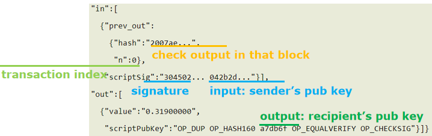
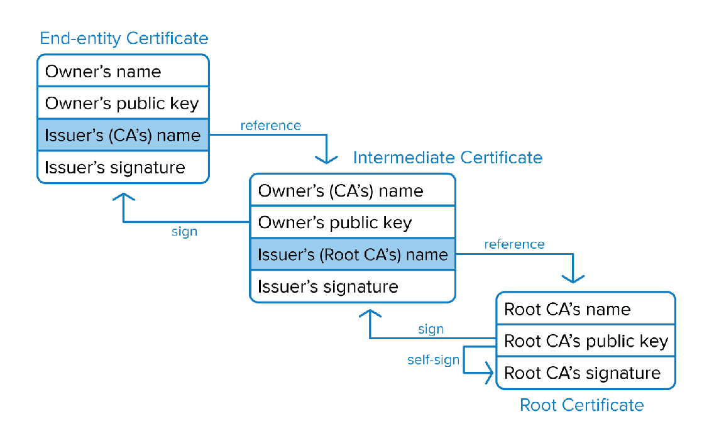
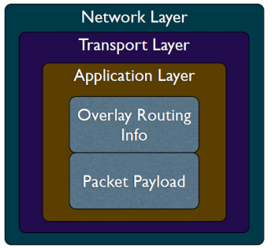
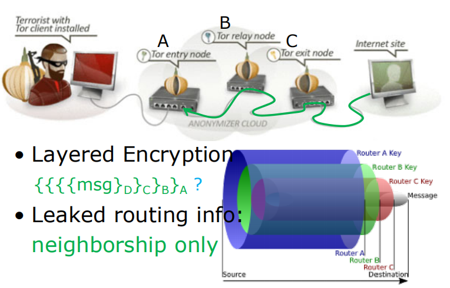
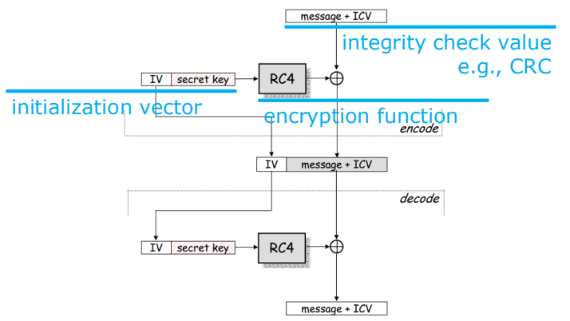
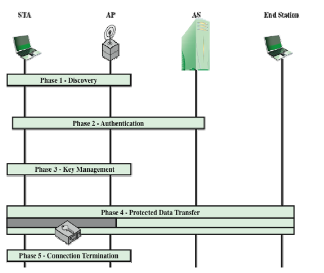

# wa

# 1-Cryptography

> confidentiality -- secrecy
> integrity -- accuracy
> authentication -- ascription
> non-repudiation -- liability

- symmetric cryptography 对称加密

  - 分组密码 block cipher
    - Feistel密码DES，AES，3DES
    - ECB、CBC、PCBC、CFB、OFB、CTR

  - 流密码 stream cipher 
    - WEP
    - RC4

- asymmetric cryptography 非对称加密
  - many-to-one secure communication
  - one-to-many proof
  - No need of a secure channel to share keys, as public key can be known to any one;

public key cryptography

- ECB
- 

- 

RSA

## 一次性密码本（One-time Pad；OTP）

以随机的密钥（key）组成明文，且只使用一次。

首先手上要有一本一次性密码本用以加密文件，接着将一次性密码本里的字母，与被加密文件的字母给依序按某个事先约定的规定一一相混，其中一个相混的作法是将字母指定数字(如在英语中，将A至Z依序指定为0至25)然后将一次性密码文本上的字母所代表的数字和被加密文件上相对应的数字给相加，再减去该语言的字母数，假设是n(如英语为26)，若就此得出来的某个数字小于零，则将该小于零的数给加上n，如此便完成加密。

举个例子，若要加密讯息“This is an example”，而用以加密的一次性密码本如下所示：

MASKL NSFLD FKJPQ

则利用指定数字的方法，可分别将两者给做以下的转换：

This is an example → 19 7 8 18 8 18 0 13 4 23 0 12 15 11 4

MASKL NSFLD FKJPQ → 12 0 18 10 11 13 18 5 11 3 5 10 9 15 16

两者依序相加后得到的讯息如下：

31 7 26 28 19 31 18 18 15 26 5 22 24 26 20

将以上得到的讯息模26后可得：

5 7 0 2 7 5 8 8 11 0 5 22 24 0 20

它也就变成了

Fhac tf ss pafwyau

而若要解密以上信息，反向操作即可。

# 2-Blockchain

transaction = I, Alice, am giving Bob one bitcoin.

digital sig verification using Alice’s public key

参与者的公钥等价于身份信息

digital signature

## double spending 双重支付

双花就是同一个比特币同时进行了两次支付的意思，这是一种利用区块确认时间差的欺诈行为。

### Defense 

等足够长的时间统计信息集

#### proof-of-work

#### proof-of-stake 

更少的块计算 

## selfish mining attack

Attacker increases the share of the reward by not broadcasting mined blocks to the network for some time and then releasing several blocks at once, making other miners lose their blocks.

为了快速把自己生成的块广播到网络里，最终某个块最长分支被选中，不立即广播，在本地多生成几个再一起释放，更有可能被选择

## block withholding attack

## sybil attack

Hacker takes control of multiple nodes
Victim is surrounded by fake nodes that close up all their transactions.

## eclipse attack

Hacker controls a large number of IP addresses or a distributed botnet.
Victim directs all outgoing connections to the IP addresses controlled by the attacker

# 3-Connection Secure 

hyper text transfer secure

threats

- Eavesdropping
- Manipulation
- Impersonation

solutions

- Encryption
- Integrity (MAC)
- Signature

## Man-In-The-Middle Attack 中间人攻击

产生原因

the attacker hijacks key-channel

### MITM Defense

Guarantee Connection Authenticity

### DNS Hijacking

For example, you want to access the www.baidu.com, but you don't know its IP address. So you ask the DNS server. The true server will tell you that its IP address is 36.152.44.96. However, the fake DNS server will tell you an IP address where attacker deploy a phishing website which may endanger user info security.

## protocol framework of HTTPS

1. connection request

   1. • CLIENT HELLO
      SSL Protocol version
      Session ID
      List of Cipher Suites
      CLIENT HELLO Extensions

2. server response

   1. ​	server hello
      1. SSL Protocol version
         	Session ID
         	Selected Cipher
         	Server Certificate               Public Key?
         	SERVER HELLO Extensions
         	Client Certificate Request (optional)

3. certificate verification

   1. Goal:
      	vouch for server public key
      Principle:
      	signed by CA’s private key
      	verifiable by CA’s public key 

   2. Certificate Authority
      trusted?
      certificate integrity?
      Certificate Date
      expired?
      Certificate Revocation List
      valid?
      Domain Name
      intended?

   3. 证书撤销列表 Certificate Revocation List

      Certificates that have been revoked by the issuing CA 
      	before their scheduled expiration date and should no longer be trusted
      Two states
      	revoked:
      	irreversibly revoked
      	hold: 	
      	only temporary invalidity, reversible

      Periodically issued by a CRL issuer
      	CA per se,
      	or some other trusted third parties
      Query supported as well
      Tradeoff between security and efficiency

      Always a time gap between 
      	when a certificate is revoked AND
      	when its revocation approaches a client

      ==证书认证过程==

      证书链 逐级认证到root certificate 无issuer‘s CA name

      

4. key exchange

5. secure communication

6. end

# 4-Anonymous Communication 

Overlay Network

- Handle routing at the **application layer**
- Tunnel messages inside other messages

Traceforward Attack

Marking Attack

中继节点通信

## Anonymizing Proxy

Advantages

- Easy to configure
- Require no active participation of receiver, which need not be aware of anonymity service
- Have been widely deployed on Internet

Disadvantages

- Require trusted third party
  	proxy may release logs,
  	or sell them,
  	or blackmail sender
- Anonymity largely depends on the 
  	(likely unknown) location of attacker

### defense

dynamize proxy location

Crowd Algorithm

untrusted proxies

⇣

## source routing

allows a sender of a packet to partially or completely specify the route the packet takes through the network.

In contrast, in conventional routing, routers in the network determine the path incrementally based on the packet's destination

POF: Protocol Oblivious Forwarding
Port bound

## onion routing 洋葱路由

要3个

- Connect to Tor entry
  Randomly select a series of Tors
  Relay messages across them
  Tor exit relays messages to destination
- Reply traffic from destination traverses
  	the reverse path 
  Maintains a bidirectional persistent 
  	multi-hop path between source and 
  	destination 
- 

# 5-Secure Routing

- unicast: deliver a message to a single node
  - dominant form of msg delivery on inet
- broadcast: deliver a message to all nodes in the network
- multicast: deliver a message to a group of nodes
- anycast: deliver a message to any one out of a group
- geocast: deliver a message to a group of nodes based on geographic location

dij

Bellman-Ford

IGP: Interior Gateway Prot

- RIP
  	routing information protocol
- OSPF	open shortest path first
  - LSP (Link-State Packet)

- BGP

routing attacks

distance-vector:
	announce 0 distance to all other nodes
link-state: 
	drop links; claim direct link to other routers
BGP:
	announce arbitrary prefix; alter paths

### Prefix Hijacking

RPKI

insufficient

# 6-Wi-Fi Security 

MITM
Replay
DoS/Jamming
Traffic Correlation

## Replay attack 重放攻击

Based on that observation, the adversary can simply replay the same message/ciphertext “a-l” to entity B, 
Making B believes that the message is from entity A, and goes to the lab;

### Defense

Limit Message Freshness

- Timestamp
- One-time session key

Higher Security Risk

- Broadcast Communication
  	wireless networking typically involves broadcast communication, which is far more susceptible to eavesdropping and jamming than wired networks;
  	wireless networks are also more vulnerable to active attacks that exploit vulnerabilities in communications protocols;

- Higher Mobility
  	far more portable and mobile, thus resulting in a number of risks;
- Constrained Resource 
  	sophisticated OS but limited memory and processing resources to counter threats, including DoS and malware
- Greater Accessibility
  	may be left unattended in remote and/or hostile locations, thus greatly increasing their vulnerability to physical attacks

what to secure for wi-fi?

confidentiality:
messages sent over wireless links 
must be encrypted

authenticity:
origin of messages received over 
wireless links must be verified

integrity:
integrity of messages received over 
wireless links must be verified

replay detection:
freshness of messages received over 
wireless links must be checked

access control:
access to the network services should 
be provided only to legitimate entities

### Passive Attack

​	passive information-gathering;
​	offline attack over the gathered info of
​	snooped packets:
​	e.g., key cracking;

### Active Attack

​	manipulate wireless communication;
​	e.g., packet injection, DoS;

- Rogue AP
  - a wireless access point that has been installed on a secure network without explicit authorization from a local admin
  - user can select to connect to the “trusted” wi-fi, e.g., ZJUWLAN
- Evil Twin AP
  - a fraudulent wireless AP that appears to be legitimate by faking the same SSID as legitimate AP

- Man-In-The-Middle

- Frame Injection

- Replay Attack

- Collision Attack

- Jamming
  - deliberate jamming, blocking or interfering with authorized wireless communication

## WEP

### WEP Encryption

Step 1: Compute CRC for the message
• CRC-32 polynomial is used

Step 2: Compute the keystream
• IV is concatenated with the key
• RC4 encryption algorithm is used on the 
64 or 128 bit concatenation

Step 3: Encrypt the plaintext
• The plaintext is XORed with the 
keystream to form the ciphertext
• The IV is prepended to the ciphertext

### WEP Decryption

Step 1: Build the keystream
• Extract the IV from the incoming frame
• Prepend the IV to the key
• Use RC4 to build the keystream

Step 2: Decrypt the plaintext and verify
• XOR the keystream with the ciphertext
• Verify the extracted message with the 
CRC

### Weakness

• AP not authenticate to STA
• 24-bit IV in plaintext
• CRC is unkeyed function
• RC4 cipher: week seeds (IV) make more easily calculated keystreams

**IEEE 802.11i**

- Authentication
  	mutual authentication enforced
  	STA  AP
- Access Control
  	enforces authentication, 
  	routes messages properly, 
  	facilitates key exchange
- Privacy with Message Integrity

MPDU Exchange

TKIP

-  designed to require only software 
  changes to devs that are implemented 
  with the older WEP
- WPA improves on WEP in that it provides the TKIP encryption scheme to scramble the encryption key and verify that it hasn't been altered during the data transfer. The major difference between WPA2 and WPA is that WPA2 improves the security of a network because it requires using a stronger encryption method called AES.

CCMP

## Relay attack 重放攻击

过程

### Defense 

Distance Bounding

is response time impractically long?
	RTT = 2*distance/velocity

additional transmission delay 

有局限

# 7-DDoS Attack & Defense

Denial-of-Service Attack:
control an attacking computer/device;
flood victim with superfluous requests;
overload victim and prevent it from fulfilling some legitimate requests;

Distributed Denial-of-Service Attack:
control many different attacking sources;
make it harder to stop the attack simply by blocking a single source;

- link layer:
  send too much traffic for switches/routers to handle
- transport layer:
  require servers to maintain large number of concurrent connections or state
- application layer:
  require servers to perform expensive queries or cryptographic operations

## TCP SYN Flood

increase backlog queue size -》attacker sends more SYN packets!

decrease timeout -》 interrupt normal service requests!

cookies?

## symmetric DDoS attack

## asymmetric DDoS attack

Smurf Attack

DNS Resolver

DNS Amplification Attack

NTP Amplification Attack

### DDoS defenses

make server harder to be attacked:
enrich server with more resources;
leverage the sources of others;

Traceback

15单选*2

5判断*2

6问答题*10