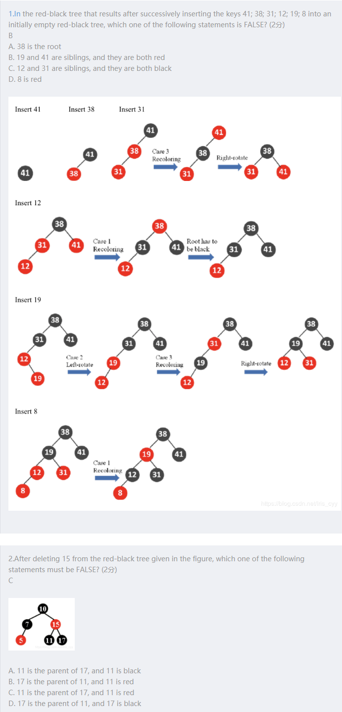

# notes

[TOC]

```c
#include <stdio.h> // freopen也包含在iostream.h中，C++代码#include <iostream.h>即可。
             
int main()
{
     freopen("sample.in", "r", stdin);
     freopen("sample.out", "w", stdout);
             
     /* 同控制台输入输出 */
             
     fclose(stdin);
     fclose(stdout);
 
     return 0;
}
```

# 1-1 AVL tree

- 是一种二叉搜索树

- 通过自我调整使树趋于**平衡**，降低树的高度，提高搜索效率

### height balanced 高度平衡

- 左子树和右子树$T_L$和$T_R$高度平衡
- $T_L$和$T_R$的高度$h_L$和$h_R$满足$|h_L-h_R|\le1$

### balance factor 平衡因子

- $BF(node)=h_L-h_R$ 
- AVL树的 $BF(node) = -1, 0, 1$

### 调整触发条件

1. 更新BF值
2. 从增加或删除节点的位置开始向上遍历，访问BF值
3. 若有BF< -1 || BF > 1 调整该节点及其子树，若一直到根节点BF都正常则无需调整
4. 调整完成，更新BF值

每次操作需要遍历从最底端到root的各个节点，时间复杂度为$O(h)$，调整操作时间复杂度为$O(1)$。故每次操作时间复杂度为$O(h)=O(lnN)$

> 证明 $h = O(lnN)$:
>
> $n_h=n_{h-1}+n_{h-2}-1=F_{h+2}-1$
>
> *F*(1)=1，*F*(2)=1
>
> 

### Tree rotation 树的旋转

#### Single rotation 单旋转


右旋 B向A的方向旋转

一轮旋转之后 旋转的一边高度增加了1 另一边减少了1

时间复杂度 $O(1)$

##### RR rotation


出问题的插入的Nov在找出问题的Mar的右子树的右子树上，所以叫RR rotation


#### Double Rotation 双旋转

##### LR rotation


C向B转 C向A转

##### RL rotation


### 代码实现


```c
#ifndef _AVL_TREE_H_
#define _AVL_TREE_H_

typedef int Type;
typedef struct AVLTreeNode{
    Type key;                    // 关键字(键值)
    int height;
    struct AVLTreeNode *left;    // 左孩子
    struct AVLTreeNode *right;    // 右孩子
}Node, *AVLTree;

// 获取AVL树的高度
int avltree_height(AVLTree tree);
// 前序遍历"AVL树"
void preorder_avltree(AVLTree tree);
// 中序遍历"AVL树"
void inorder_avltree(AVLTree tree);
// 后序遍历"AVL树"
void postorder_avltree(AVLTree tree);
void print_avltree(AVLTree tree, Type key, int direction);

// (递归实现)查找"AVL树x"中键值为key的节点
Node* avltree_search(AVLTree x, Type key);
// (非递归实现)查找"AVL树x"中键值为key的节点
Node* iterative_avltree_search(AVLTree x, Type key);
// 查找最小结点：返回tree为根结点的AVL树的最小结点。
Node* avltree_minimum(AVLTree tree);
// 查找最大结点：返回tree为根结点的AVL树的最大结点。
Node* avltree_maximum(AVLTree tree);
// 将结点插入到AVL树中，返回根节点
Node* avltree_insert(AVLTree tree, Type key);
// 删除结点(key是节点值)，返回根节点
Node* avltree_delete(AVLTree tree, Type key);
// 销毁AVL树
void destroy_avltree(AVLTree tree);
#endif

/**
 * AVL树(C语言): C语言实现的AVL树。
 *
 * @author skywang
 * @date 2013/11/07
 */

#include <stdio.h>
#include <stdlib.h>
#include "avltree.h"

#define HEIGHT(p)    ( (p==NULL) ? -1 : (((Node *)(p))->height) )
#define MAX(a, b)    ( (a) > (b) ? (a) : (b) )

/*
 * 获取AVL树的高度
 */
int avltree_height(AVLTree tree)
{
    return HEIGHT(tree);
}

/*
 * 前序遍历"AVL树"
 */
void preorder_avltree(AVLTree tree)
{
    if(tree != NULL)
    {
        printf("%d ", tree->key);
        preorder_avltree(tree->left);
        preorder_avltree(tree->right);
    }
}


/*
 * 中序遍历"AVL树"
 */
void inorder_avltree(AVLTree tree)
{
    if(tree != NULL)
    {
        inorder_avltree(tree->left);
        printf("%d ", tree->key);
        inorder_avltree(tree->right);
    }
}

/*
 * 后序遍历"AVL树"
 */
void postorder_avltree(AVLTree tree)
{
    if(tree != NULL)
    {
        postorder_avltree(tree->left);
        postorder_avltree(tree->right);
        printf("%d ", tree->key);
    }
}

/*
 * (递归实现)查找"AVL树x"中键值为key的节点
 */
Node* avltree_search(AVLTree x, Type key)
{
    if (x==NULL || x->key==key)
        return x;

    if (key < x->key)
        return avltree_search(x->left, key);
    else
        return avltree_search(x->right, key);
}

/*
 * (非递归实现)查找"AVL树x"中键值为key的节点
 */
Node* iterative_avltree_search(AVLTree x, Type key)
{
    while ((x!=NULL) && (x->key!=key))
    {
        if (key < x->key)
            x = x->left;
        else
            x = x->right;
    }

    return x;
}

/* 
 * 查找最小结点：返回tree为根结点的AVL树的最小结点。
 */
Node* avltree_minimum(AVLTree tree)
{
    if (tree == NULL)
        return NULL;

    while(tree->left != NULL)
        tree = tree->left;
    return tree;
}
 
/* 
 * 查找最大结点：返回tree为根结点的AVL树的最大结点。
 */
Node* avltree_maximum(AVLTree tree)
{
    if (tree == NULL)
        return NULL;

    while(tree->right != NULL)
        tree = tree->right;
    return tree;
}

/*
 * LL：左左对应的情况(左单旋转)。
 *
 * 返回值：旋转后的根节点
 */
static Node* left_left_rotation(AVLTree k2)
{
    AVLTree k1;

    k1 = k2->left;
    k2->left = k1->right;
    k1->right = k2;

    k2->height = MAX( HEIGHT(k2->left), HEIGHT(k2->right)) + 1;
    k1->height = MAX( HEIGHT(k1->left), k2->height) + 1;

    return k1;
}

/*
 * RR：右右对应的情况(右单旋转)。
 *
 * 返回值：旋转后的根节点
 */
static Node* right_right_rotation(AVLTree k1)
{
    AVLTree k2;

    k2 = k1->right;
    k1->right = k2->left;
    k2->left = k1;

    k1->height = MAX( HEIGHT(k1->left), HEIGHT(k1->right)) + 1;
    k2->height = MAX( HEIGHT(k2->right), k1->height) + 1;

    return k2;
}

/*
 * LR：左右对应的情况(左双旋转)。
 *
 * 返回值：旋转后的根节点
 */
static Node* left_right_rotation(AVLTree k3)
{
    k3->left = right_right_rotation(k3->left);

    return left_left_rotation(k3);
}

/*
 * RL：右左对应的情况(右双旋转)。
 *
 * 返回值：旋转后的根节点
 */
static Node* right_left_rotation(AVLTree k1)
{
    k1->right = left_left_rotation(k1->right);

    return right_right_rotation(k1);
}

/*
 * 创建AVL树结点。
 *
 * 参数说明：
 *     key 是键值。
 *     left 是左孩子。
 *     right 是右孩子。
 */
static Node* avltree_create_node(Type key, Node *left, Node* right)
{
    Node* p;

    if ((p = (Node *)malloc(sizeof(Node))) == NULL)
        return NULL;
    p->key = key;
    p->height = 0;
    p->left = left;
    p->right = right;

    return p;
}

/* 
 * 将结点插入到AVL树中，并返回根节点
 *
 * 参数说明：
 *     tree AVL树的根结点
 *     key 插入的结点的键值
 * 返回值：
 *     根节点
 */
Node* avltree_insert(AVLTree tree, Type key)
{
    if (tree == NULL) 
    {
        // 新建节点
        tree = avltree_create_node(key, NULL, NULL);
        if (tree==NULL)
        {
            printf("ERROR: create avltree node failed!\n");
            return NULL;
        }
    }
    else if (key < tree->key) // 应该将key插入到"tree的左子树"的情况
    {
        tree->left = avltree_insert(tree->left, key);
        // 插入节点后，若AVL树失去平衡，则进行相应的调节。
        if (HEIGHT(tree->left) - HEIGHT(tree->right) == 2)
        {
            if (key < tree->left->key)
                tree = left_left_rotation(tree);
            else
                tree = left_right_rotation(tree);
        }
    }
    else if (key > tree->key) // 应该将key插入到"tree的右子树"的情况
    {
        tree->right = avltree_insert(tree->right, key);
        // 插入节点后，若AVL树失去平衡，则进行相应的调节。
        if (HEIGHT(tree->right) - HEIGHT(tree->left) == 2)
        {
            if (key > tree->right->key)
                tree = right_right_rotation(tree);
            else
                tree = right_left_rotation(tree);
        }
    }
    else //key == tree->key)
    {
        printf("添加失败：不允许添加相同的节点！\n");
    }

    tree->height = MAX( HEIGHT(tree->left), HEIGHT(tree->right)) + 1;

    return tree;
}

/* 
 * 删除结点(z)，返回根节点
 *
 * 参数说明：
 *     ptree AVL树的根结点
 *     z 待删除的结点
 * 返回值：
 *     根节点
 */
static Node* delete_node(AVLTree tree, Node *z)
{
    // 根为空 或者 没有要删除的节点，直接返回NULL。
    if (tree==NULL || z==NULL)
        return NULL;

    if (z->key < tree->key)        // 待删除的节点在"tree的左子树"中
    {
        tree->left = delete_node(tree->left, z);
        // 删除节点后，若AVL树失去平衡，则进行相应的调节。
        if (HEIGHT(tree->right) - HEIGHT(tree->left) == 2)
        {
            Node *r =  tree->right;
            if (HEIGHT(r->left) > HEIGHT(r->right))
                tree = right_left_rotation(tree);
            else
                tree = right_right_rotation(tree);
        }
    }
    else if (z->key > tree->key)// 待删除的节点在"tree的右子树"中
    {
        tree->right = delete_node(tree->right, z);
        // 删除节点后，若AVL树失去平衡，则进行相应的调节。
        if (HEIGHT(tree->left) - HEIGHT(tree->right) == 2)
        {
            Node *l =  tree->left;
            if (HEIGHT(l->right) > HEIGHT(l->left))
                tree = left_right_rotation(tree);
            else
                tree = left_left_rotation(tree);
        }
    }
    else    // tree是对应要删除的节点。
    {
        // tree的左右孩子都非空
        if ((tree->left) && (tree->right))
        {
            if (HEIGHT(tree->left) > HEIGHT(tree->right))
            {
                // 如果tree的左子树比右子树高；
                // 则(01)找出tree的左子树中的最大节点
                //   (02)将该最大节点的值赋值给tree。
                //   (03)删除该最大节点。
                // 这类似于用"tree的左子树中最大节点"做"tree"的替身；
                // 采用这种方式的好处是：删除"tree的左子树中最大节点"之后，AVL树仍然是平衡的。
                Node *max = avltree_maximum(tree->left);
                tree->key = max->key;
                tree->left = delete_node(tree->left, max);
            }
            else
            {
                // 如果tree的左子树不比右子树高(即它们相等，或右子树比左子树高1)
                // 则(01)找出tree的右子树中的最小节点
                //   (02)将该最小节点的值赋值给tree。
                //   (03)删除该最小节点。
                // 这类似于用"tree的右子树中最小节点"做"tree"的替身；
                // 采用这种方式的好处是：删除"tree的右子树中最小节点"之后，AVL树仍然是平衡的。
                Node *min = avltree_maximum(tree->right);
                tree->key = min->key;
                tree->right = delete_node(tree->right, min);
            }
        }
        else
        {
            Node *tmp = tree;
            tree = tree->left ? tree->left : tree->right;
            free(tmp);
        }
    }

    return tree;
}

/* 
 * 删除结点(key是节点值)，返回根节点
 *
 * 参数说明：
 *     tree AVL树的根结点
 *     key 待删除的结点的键值
 * 返回值：
 *     根节点
 */
Node* avltree_delete(AVLTree tree, Type key)
{
    Node *z; 

    if ((z = avltree_search(tree, key)) != NULL)
        tree = delete_node(tree, z);
    return tree;
}

/* 
 * 销毁AVL树
 */
void destroy_avltree(AVLTree tree)
{
    if (tree==NULL)
        return ;

    if (tree->left != NULL)
        destroy_avltree(tree->left);
    if (tree->right != NULL)
        destroy_avltree(tree->right);

    free(tree);
}

/*
 * 打印"AVL树"
 *
 * tree       -- AVL树的节点
 * key        -- 节点的键值 
 * direction  --  0，表示该节点是根节点;
 *               -1，表示该节点是它的父结点的左孩子;
 *                1，表示该节点是它的父结点的右孩子。
 */
void print_avltree(AVLTree tree, Type key, int direction)
{
    if(tree != NULL)
    {
        if(direction==0)    // tree是根节点
            printf("%2d is root\n", tree->key, key);
        else                // tree是分支节点
            printf("%2d is %2d's %6s child\n", tree->key, key, direction==1?"right" : "left");

        print_avltree(tree->left, tree->key, -1);
        print_avltree(tree->right,tree->key,  1);
    }
}

```

# 1-2 Splay Trees

Splay Trees 通过**将被访问到的节点放于根**，提升访问速度，使得m次连续搜索的复杂度为$O(mlogN)$——摊还分析。

### 调整方法


记被访问的节点为X，其父节点为P，其祖父节点为G。

#### P是根节点

交换P与X。结束调整。

#### P不是根节点

##### Zig-Zig


X, P, G处于同一方向时，只需旋转一次，将X, P, G颠倒即可。

##### Zig-Zag


X, P, G处于不同方向时，需要旋转两次，先旋转P, X，再旋转X, G

### 删除

- 找到该节点

  Find X which will be at the root

- 删除该节点 

  Remove X

- 访问该节点左子树中最大的节点（此时该最大节点会处于该左子树的根，且没有右儿子）

  FindMax($T_L$)

- 使该节点的右子树成为左子树根的右儿子

  Make $T_R$ the right child of the root of $T_L$ .

# 1-3 Amortized Analysis 摊还分析（均摊分析）

worst-case bound $\geq$ amortized bound $ \geq $ average-case bound

均摊界 不涉及概率

### Aggregate analysis 聚合分析

对所有n，一个n个操作的序列最坏情况下花费的总时间为T(n)。因此，在最坏情况下，每个操作的平均时间，或**摊还代价**为T(n)/n。

#### MultiPop(S,k)

弹出k个对象，如果栈中对象的数量少于k，则将所有对象弹出。

n个Push, Pop, MultiPop 操作在一个**空栈**上的运行时间：

一个MultiPop操作的最坏情况时间为О(n)，PUSH和POP最坏情况时间均为1，因为栈的大小为最大为n，操作序列的**最坏情况**时间为О(n^2)。

在聚合分析中，在一个空栈上执行PUSH、POP、MultiPop的操作序列，代价最多是О(n)。因为我们将一个对象压入到栈后，最多只将其弹出一次，所以一个非空的栈，可以执行的POP次数最多为n。因此上述操作序列最多花费О(n)时间，而一个操作的平均时间为О(n) / n = О(1)。

每个操作的**摊还代价**设定为**平均代价**。所以，这三种操作的摊还代价均为О(1)。

### Accounting method 核算法

当我们赋予一个操作的费用也就是它的摊还代价 amortized cost $ \hat{c}_i$ 超出了其实际代价 actual cost $c_i$ 时，我们将差额存入数据结构中的特定对象，存入的差额成为信用 credit 。对于后续操作中摊还代价小于实际代价的情况，信用可以用来支付 pay 差额。


#### Stack


PUSH时我们将1元的代价支付PUSH操作的实际代价，将剩余的1元存为信用，这1元实际上是作为将来被POP时代价的预付费。

当执行一个POP时，并不缴纳任何费用，而是使用存储的信用来支付其实际代价，对于MULTIPOP也是一样的。因为栈中元素的数量总是非负的，Pop次数大于Pop或MuitiPop，所以可以保证信用也非负的。

因此，对任意n个PUSH、POP、MULTIPOP组成的序列，总摊还代价О(n)为总实际代价的上界。

### Potential method 势能法

势能函数$Φ$

对i = 1,2,…,n，Di为数据结构Di-1执行第i个操作得到的结果数据结构，Φ(Di)为数据结构Di的势。

$\hat{c}_i = c_i + Φ(D_i) - Φ（D_{i-1}）$
即每个操作的摊还代价等于其实际代价加上此操作引起的势能变化。

则n个操作的总摊还代价为


A good potential function should always assume its **minimum** at the start of the sequence.

#### Stack


#### Splay Trees


The amortized time to splay a tree with root T at node X is at most $3( R( T ) – R ( X ) ) + 1 = O(log N)$.

------

### 题目

> 1. Insert 1, 2, 3, 4, 5, and 6 one by one into an initially empty AVL tree. Then the preorder traversal sequence of the resulting tree must be {4, 2, 1, 3, 5, 6}.
>
>    T
>    
>    
>    
>    越来越大的
>    
>    


### Reference

https://blog.csdn.net/Woolseyyy/article/details/51505383

https://blog.csdn.net/Iris_cyy/article/details/93589214

# 2-1 Red-black tree

平衡二叉搜索树

### 定义

1. 非黑即红

2. 根黑

3. 叶子结点黑

   (一个哨兵节点NIL=NULL  root和实际的leaf都指向它 External node 与包含键值key的Internal node相对) 

4. 红结点的儿子黑

5. 对每个节点，到后裔的所有简单路径上的黑结点数相同 bh

#### black-height 黑高

bh(x)=x到叶结点的黑结点数（不包括x）

bh(Tree)=bh(root)

包含N个节点的红黑树的高度最大是2ln(N+1)
A red-black tree with $N$ internal nodes has height at most $2ln(N +1)$

### Insert 插入

插入的染红


插入11会破坏性质2 插入4之后破坏了性质4

case 1 可能破坏根节点的性质24

case 2 左旋

case 3 父节点和祖先节点颜色交换 右旋                  symmetric对称情况


红黑树的插入最多进行三次旋转

#### 迭代


```c
//RB-INSERT-FIXUP(T,z)
while z.p.color == RED 
  if z.p == z.p.p.left
    y = z.p.p.right 
    if y.color == RED
      z.p.color = BLACK   //case 1
      y.color = BLACK     //case 1
      z.p.p.color = RED   //case 1
      z = z.p.p           //case 1
    else if z == z.p.right
      z = z.p             //case 2
      LEFT-ROTATE(T,z)    //case 2
    z.p.color = BLACK     //case 3
    z.p.p.color = RED     //case 3
    RIGHT-ROTATE(T,z.p.p) //case 3
  else (same as then clause with "right" and "left" exchanged
T.root.color = BLACK 
```


循环不变式（这三条性质在循环开始前和循环中一直不变）

1. z红
2. z.p是根节点，则z.p为黑
3. 最多一个红黑性质被破坏，要么是性质2要么是性质4

### Deletion 删除

O(log n)

#### 删叶子节点

把父节点连向NIL

#### 删degree=1的节点

用子节点代替该节点

#### 删degree=2的节点

1. 左子树中最大的节点或右子树中最小的节点代替该节点，并且保持该节点颜色不变
2. 从子树中删除替代节点

删除z


### Number of rotations


### Code

https://blog.csdn.net/Iris_cyy/article/details/93600692

------

### 题目

> 



The functions `IsRBTree` is to check if a given binary search tree `T` is a red-black tree. Return `true` if `T` is, or `false` if not.

The red-black tree structure is defined as the following:

```c
typedef enum { red, black } colors;
typedef struct RBNode *PtrToRBNode;
struct RBNode{
    int Data;
    PtrToRBNode Left, Right, Parent;
    int BH; /* black height */
    colors Color;
};
typedef PtrToRBNode RBTree;
```

Please fill in the blanks.

```c++
bool IsRBTree( RBTree T )
{
    int LeftBH, RightBH;
    //1.空树是RBTree
    //root==NULL
    if ( !T ) return true;
    //2.根节点是黑的才能满足
    if ( T->Color == black ) T->BH = 1;
    else {
        /* false if the max of the left is > than us */
         if ( T->Left && (T->Left->Color == red)) return false;
        /* false if the min of the right is <= than us */
         if ( T->Right && (T->Right->Color == red) ) return false;
    }
    //root->_left == NULL&&root->_right == NULL
    if ( !T->Left && !T->Right ) return true;
    
    if ( (1分)) {
       if ( T->Left ) LeftBH = T->Left->BH;
       else LeftBH = 0;
       if ( T->Right ) RightBH = T->Right->BH;
       else RightBH = 0;
       if ( LeftBH == RightBH ) { 
          T->BlackHeight=LeftBH;
          return true;
       }
       else return false;
    }
    else return false;
}
```


https://www.geeksforgeeks.org/a-program-to-check-if-a-binary-tree-is-bst-or-not/

# 2-2 B+ tree

### 定义

A B+ tree of a order M (M最好是3/4)

1. 根要么是叶子节点要么是有2到M个儿子
2. 所有的非叶节点（除了根）都有⌈M/2⌉到M个儿子
3. 所有的叶结点有相同的depth

### Insert

$T=O(M)$

$Depth(M,N)=O(\lceil log_{\lceil M/2\rceil}N\rceil)$

$T_{Find}(M,N)=O(logN)$


```pseudocode
Btree  Insert ( ElementType X,  Btree T ) 
{ 
	Search from root to leaf for X and find the proper leaf node;
	Insert X;
	while ( this node has M+1 keys ) {
    		split it into 2 nodes with ⌈(M+1)/2⌉ and $\lfloor$(M+1)/2$\rfloor$ keys, respectively;
    		if (this node is the root)
        		create a new root with two children;
    		check its parent;
	}
} 
```

https://blog.csdn.net/Woolseyyy/article/details/51557672

#### Deletion

Deletion is similar to insertion except that the root is removed when it loses two children.

------

### 题目

>1. In a B+ tree, leaves and nonleaf nodes have some key values in common. 
>
>   T


# 3 Inverted File Index 文件倒排索引 

### 文件倒排索引建立过程 Index Generator

1. 从文件中读取词
2. 将该词提取为词干(**word stemming**)，即去除第三人称形式、过去式、进行时等形式，留下词干），并去除分词(**stop word**)，即”a”, “is”等没有意义的词。
3. 检查该词是否已经在词典之中。
4. 若不在，则将该词添加入词典之中。更新索引信息。
5. 建立完毕后，将索引文件存入磁盘。

```pseudocode
while ( read a document D ) {
    while ( read a term T in D ) {
        if ( Find( Dictionary, T ) == false )
            Insert( Dictionary, T );
        Get T’s posting list;
        Insert a node to T’s posting list;
    }
}
Write the inverted index to disk;
```

### 访问 accessing a term

- 搜索树 Search trees(B- trees, B+ trees, Tries)

- 哈希表 Hashing

  > 花费常数时间，**访问更快**；
  >
  > 但存储不灵活

### 倒排索引分布式存储 Distributed indexing

- Term-partitioned Index

  > 按照关键词将文件存在不同的主机上，全局建立索引。
  >
  > 查找性能更高

- Document-partitioned Index

  > 按照文件号将文件存在不同主机上，在每台主机上建立局部索引。
  >
  > 更加可靠

### 动态索引 dynamic indexing

- 需要被索引的文档集可能是动态变化的（添加新文档、删除现有文档）

- 索引需要定时更新，并建立主索引(**Main Index**)和辅助索引(**auxiliary index**)

  > 大的主索引，保存在磁盘中;
  >
  > 小的用于存储新文档信息的辅助索引，保存在内存中。
  >
  > 检索时可以同时遍历两个索引并将结果合并。
  >
  > 文档的删除记录在一个无效位向量中，在返回检索结果之前可以利用它过滤掉已经删除的文档。每当辅助索引变得很大时，就将它合并到主索引中。

### 压缩 compression

- 将词典看为单一字符串，以消除用定长方法来存储单词所存在的空间浪费；
- docID的存储只记录与上一项docID的差值(**gap**)来减少docID存储长度。

### 阈值 thresholding

- 通过只检索权重(**weight**)为前x%(**thresholding**)的来提高效率

- 评估搜索引擎性能

  - index建立索引速度
  - search响应时间
  - query language表达能力

### User happiness

- **Data Retrieval** Performance Evaluation (after establishing correctness)
  - Response time
  - Index space
- **Information Retrieval** Performance Evaluation
  - How relevant is the answer set?

### 评估相关度 ==**relevance measurement**==

1. A benchmark **document** collection 基准测试集文档

2. A benchmark suite of **queries** 基准query

3. A binary **assessment** of either <u>Relevant</u> or <u>Irrelevant</u> for each query-doc pair 手工标注是否关联 构建测试集

   

- **精确度(Precision)**

  所有收回的中相关的占的比例 retrieved documents that are irrelevant

  $P=\frac{R_R}{R_R+I_R}$

- **收回度(Recall)**

  所有相关的中收回的所占比例 relevant documents retrieved

  $R=\frac{R_R}{R_R+R_N}$
  
  

------
### 题目

> 1. When measuring the relevancy of the answer set of a search engine, the recall is low means that most of the relevant documents are not retrieved.
>
>    T
>
>    
>
> 2. When measuring the relevancy of the answer set of a search engine, the precision is low means that most of the retrieved documents are irrelevant. 
>
>    T
>

### Reference

https://blog.csdn.net/Woolseyyy/article/details/51559937

# 4-1 Leftist Heaps 左偏树/左倾堆

两个都是N大小的二叉堆的合并，一共进行N次插入，花费O(N)的代价。

顺序性质相同：小的在上 结构性质不同：高度不平衡

### NPL

null path length, Npl(X)：从任意节点X出发到没有俩儿子的节点的最短距离

Npl(NULL) = –1

Npl(X) = min { Npl(C) + 1, for all C as children of X }

### 定义

对堆中的每个结点$X$， $Npl(\mathrm{left\ child})\geq Npl(\mathrm{{right\ child}})$

$r$ nodes on the **right path** must have at least $2^r – 1$ nodes.

### Merge

$T_P=O(logN)$

#### recursive version

1. 对比根节点 将H1的右子树和H2合并(怎么合并的?)
2. 把合并后的H2作为H1的新右子树
3. 左右交换满足Npl的条件


```c
struct TreeNode 
{ 
	ElementType	    Element;
	PriorityQueue	    Left;
	PriorityQueue	    Right;
	int		    Npl;
} ;

PriorityQueue  Merge ( PriorityQueue H1, PriorityQueue H2 )
{ 
	if ( H1 == NULL )   return H2;	
	if ( H2 == NULL )   return H1;	
	if ( H1->Element < H2->Element )  return Merge1( H1, H2 );
	else return Merge1( H2, H1 );
}

static PriorityQueue
Merge1( PriorityQueue H1, PriorityQueue H2 )
{ 
	if ( H1->Left == NULL ) 	/* single node */
		H1->Left = H2;	/* H1->Right is already NULL 
				    and H1->Npl is already 0 */
	else {
		H1->Right = Merge( H1->Right, H2 );     /* Step 1 & 2 */
		if ( H1->Left->Npl < H1->Right->Npl )
			SwapChildren( H1 );	/* Step 3 */
		H1->Npl = H1->Right->Npl + 1;
	} /* end else */
	return H1;
}
```

#### Iterative version

1. 右路径排序
2. 交换孩子


### 题目


# 4-2 Skew Heaps 斜堆

y一种简单的左偏树

Any $M$ consecutive operations take at most $O(M log N)$ time.

### Merge

Always swap the left and right children except that the largest of all the nodes on the right paths does not have its children swapped.  No Npl.


### Amortized Analysis

$T_{amortized} = O(log N)$ 


## 树堆总结

树

|       | 访问                                                         | 插入(amo) | M次插入                     | 删除(amo) |
| ----- | ------------------------------------------------------------ | --------- | --------------------------- | --------- |
| AVL   | O(logN)                                                      | O(logN)   | O(MlogN)                    | O(logN)   |
| Splay | O(logN)                                                      |           |                             |           |
| RB    | O(logN)                                                      | O(1)      | O(M+N)                      | O(1)      |
| B+    | O(logN)<br>(深度为$O(\lceil \log_{\lceil M/2\rceil} N\rceil)$) |           | $O(\frac{M}{\log M}\log N)$ |           |

堆

|                | 访问最小        | 插入(amo) | M次插入  | 删除最小(amo) | Merge   |
| -------------- | --------------- | --------- | -------- | ------------- | ------- |
| Leftiest       | O(1)            |           |          | O(logN)       |         |
| Skew           | O(1)            |           | O(MlogN) | O(logN)       | O(logN) |
| Binomial Queue | O(logN) or O(1) | O(1)      |          | O(logN)       | O(logN) |


# 5 Binomial Queue 二项队列

### 定义

- A binomial queue is not a heap-ordered tree, but rather a collection of heap-ordered trees, known as a **forest**.  Each heap-ordered tree is a **binomial tree**.
- A binomial tree of height 0 is a one-node tree.
  A binomial tree, Bk, of height k is formed by attaching a binomial tree, Bk – 1, to the root of another binomial tree, Bk – 1.


- Bk的根有k个儿子，也就是B0, B1,...,Bk-1，Bk有2^k个结点，深度为d的节点数是C(k,d)


### Operations


- If the smallest nonexistent binomial tree is Bi , then 
  Tp = Const · (i + 1).
- Performing N Inserts on an initially empty binomial queue will take O(N) worst-case time.  Hence the average time is **constant**.


### 实现


### Code

```c
typedef struct BinNode *Position;
typedef struct Collection *BinQueue;
typedef struct BinNode *BinTree;  /* missing from p.176 */

struct BinNode 
{ 
	ElementType	    Element;
	Position	    LeftChild;
	Position 	    NextSibling;
} ;

struct Collection 
{ 
	int	    	CurrentSize;  /* total number of nodes */
	BinTree	TheTrees[ MaxTrees ];
} ;

BinTree
CombineTrees( BinTree T1, BinTree T2 )
{  /* merge equal-sized T1 and T2 */
	if ( T1->Element > T2->Element )
		/* attach the larger one to the smaller one */
		return CombineTrees( T2, T1 );
	/* insert T2 to the front of the children list of T1 */
	T2->NextSibling = T1->LeftChild;
	T1->LeftChild = T2;
	return T1;
}

BinQueue  Merge( BinQueue H1, BinQueue H2 )
{	BinTree T1, T2, Carry = NULL; 	
	int i, j;
	if ( H1->CurrentSize + H2-> CurrentSize > Capacity )  ErrorMessage();
	H1->CurrentSize += H2-> CurrentSize;
	for ( i=0, j=1; j<= H1->CurrentSize; i++, j*=2 ) {
	    T1 = H1->TheTrees[i]; T2 = H2->TheTrees[i]; /*current trees */
	    switch( 4*!!Carry + 2*!!T2 + !!T1 ) { 
		case 0: /* 000 */
	 	case 1: /* 001 */  break;	
		case 2: /* 010 */  H1->TheTrees[i] = T2; H2->TheTrees[i] = NULL; break;
		case 4: /* 100 */  H1->TheTrees[i] = Carry; Carry = NULL; break;
		case 3: /* 011 */  Carry = CombineTrees( T1, T2 );
			            H1->TheTrees[i] = H2->TheTrees[i] = NULL; break;
		case 5: /* 101 */  Carry = CombineTrees( T1, Carry );
			            H1->TheTrees[i] = NULL; break;
		case 6: /* 110 */  Carry = CombineTrees( T2, Carry );
			            H2->TheTrees[i] = NULL; break;
		case 7: /* 111 */  H1->TheTrees[i] = Carry; 
			            Carry = CombineTrees( T1, T2 ); 
			            H2->TheTrees[i] = NULL; break;
	    } /* end switch */
	} /* end for-loop */
	return H1;
}

ElementType  DeleteMin( BinQueue H )
{	BinQueue DeletedQueue; 
	Position DeletedTree, OldRoot;
	ElementType MinItem = Infinity;  /* the minimum item to be returned */	
	int i, j, MinTree; /* MinTree is the index of the tree with the minimum item */

	if ( IsEmpty( H ) )  {  PrintErrorMessage();  return –Infinity; }

	for ( i = 0; i < MaxTrees; i++) {  /* Step 1: find the minimum item */
	    if( H->TheTrees[i] && H->TheTrees[i]->Element < MinItem ) { 
		MinItem = H->TheTrees[i]->Element;  MinTree = i;    } /* end if */
	} /* end for-i-loop */
	DeletedTree = H->TheTrees[ MinTree ];  
	H->TheTrees[ MinTree ] = NULL;   /* Step 2: remove the MinTree from H => H’ */ 
	OldRoot = DeletedTree;   /* Step 3.1: remove the root */ 
	DeletedTree = DeletedTree->LeftChild;   free(OldRoot);
	DeletedQueue = Initialize();   /* Step 3.2: create H” */ 
	DeletedQueue->CurrentSize = ( 1<<MinTree ) – 1;  /* 2MinTree – 1 */
	for ( j = MinTree – 1; j >= 0; j – – ) {  
	    DeletedQueue->TheTrees[j] = DeletedTree;
	    DeletedTree = DeletedTree->NextSibling;
	    DeletedQueue->TheTrees[j]->NextSibling = NULL;
	} /* end for-j-loop */
	H->CurrentSize  – = DeletedQueue->CurrentSize + 1;
	H = Merge( H, DeletedQueue ); /* Step 4: merge H’ and H” */ 
	return MinItem;
}
```


------

### 题目

# 6 Backtracking 回溯法

- 一个一个检查

  make a list of all candidate answers, examine each, and following the examination of all or some of the candidates, declare the identified answer. 

- pruning 剪枝

  Backtracking enables us to **eliminate** the explicit examination of a large subset of the candidates while still guaranteeing that the answer will be found if the algorithm is run to termination.

依次尝试所有的解空间，如果不可行回退到上一个

### 8皇后问题

### 加油站问题

给定距离集合n(n-1)/2 求n个加油站的位置

```c
bool Reconstruct ( DistType X[ ], DistSet D, int N, int left, int right )
{ /* X[1]...X[left-1] and X[right+1]...X[N] are solved */
    bool Found = false;
    if ( Is_Empty( D ) )
        return true; /* solved */
    D_max = Find_Max( D );
    /* option 1：X[right] = D_max */
    /* check if |D_max-X[i]|D is true for all X[i]’s that have been solved */
    OK = Check( D_max, N, left, right ); /* pruning */
    if ( OK ) { /* add X[right] and update D */
        X[right] = D_max;
        for ( i=1; i<left; i++ )  Delete( |X[right]-X[i]|, D);
        for ( i=right+1; i<=N; i++ )  Delete( |X[right]-X[i]|, D);
        Found = Reconstruct ( X, D, N, left, right-1 );
        if ( !Found ) { /* if does not work, undo */
            for ( i=1; i<left; i++ )  Insert( |X[right]-X[i]|, D);
            for ( i=right+1; i<=N; i++ )  Insert( |X[right]-X[i]|, D);
        }
    }
    /* finish checking option 1 */
    if ( !Found ) { /* if option 1 does not work */
        /* option 2: X[left] = X[N]-D_max */
        OK = Check( X[N]-D_max, N, left, right );
        if ( OK ) {
            X[left] = X[N] – D_max;
            for ( i=1; i<left; i++ )  Delete( |X[left]-X[i]|, D);
            for ( i=right+1; i<=N; i++ )  Delete( |X[left]-X[i]|, D);
            Found = Reconstruct (X, D, N, left+1, right );
            if ( !Found ) {
                for ( i=1; i<left; i++ ) Insert( |X[left]-X[i]|, D);
                for ( i=right+1; i<=N; i++ ) Insert( |X[left]-X[i]|, D);
            }
        }
        /* finish checking option 2 */
    } /* finish checking all the options */
    
    return Found;
}

```

### Tic-tac-toe


#### ==alpha-belta pruning==


max就是取子结点的max，实时随着遍历更新    ？处对他祖父已经没影响了

### Template

```c
bool Backtracking ( int i )
{   Found = false;
    if ( i > N )
        return true; /* solved with (x1, …, xN) */
    for ( each xi  Si ) { 
        /* check if satisfies the restriction R */
        OK = Check((x1, …, xi) , R ); /* pruning */
        if ( OK ) {
            Count xi in;
            Found = Backtracking( i+1 );
            if ( !Found )
                Undo( i ); /* recover to (x1, …, xi-1) */
        }
        if ( Found ) break; 
    }
    return Found;
}

```


# 7 Divide and Conquer 分治法

分 治 合

- substitution method
- recursion-tree method
- master method


#### 题目


# 8 Dynamic programming 动态规划

矩阵乘法

### Code

```c
/* r contains number of columns for each of the N matrices */ 
/* r[ 0 ] is the number of rows in matrix 1 */ 
/* Minimum number of multiplications is left in M[ 1 ][ N ] */ 
void OptMatrix( const long r[ ], int N, TwoDimArray M ) 
{   int  i, j, k, L; 
    long  ThisM; 
    for( i = 1; i <= N; i++ )   M[ i ][ i ] = 0; 
    for( k = 1; k < N; k++ ) /* k = j - i */ 
        for( i = 1; i <= N - k; i++ ) { /* For each position */ 
			j = i + k;    M[ i ][ j ] = Infinity; 
			for( L = i; L < j; L++ ) { 
	    		ThisM = M[ i ][ L ] + M[ L + 1 ][ j ] + r[ i - 1 ] * r[ L ] * r[ j ]; 
	    		if ( ThisM < M[ i ][ j ] )  /* Update min */ 
				M[ i ][ j ] = ThisM; 
			}  /* end for-L */
        }  /* end for-Left */
}
/* A[ ] contains the adjacency matrix with A[ i ][ i ] = 0 */ 
/* D[ ] contains the values of the shortest path */ 
/* N is the number of vertices */ 
/* A negative cycle exists iff D[ i ][ i ] < 0 */ 
void AllPairs( TwoDimArray A, TwoDimArray D, int N ) 
{   int  i, j, k; 
    for ( i = 0; i < N; i++ )  /* Initialize D */ 
    	for( j = 0; j < N; j++ )
	 		D[ i ][ j ] = A[ i ][ j ]; 
    for( k = 0; k < N; k++ )  /* add one vertex k into the path */
         for( i = 0; i < N; i++ ) 
	 		for( j = 0; j < N; j++ ) 
	    		if( D[ i ][ k ] + D[ k ][ j ] < D[ i ][ j ] ) 
					/* Update shortest path */ 
					D[ i ][ j ] = D[ i ][ k ] + D[ k ][ j ]; 
}	
```


------

### 题目

> 1. To solve a problem by dynamic programming instead of recursions, the key approach is to store the results of computations for the subproblems so that we only have to compute each different subproblem once. Those solutions can be stored in an array or a hash table.
>
>    T


# 9 Greedy Method 贪心算法


# 10 NP-Completeness 计算复杂性理论

### 多项式(polynomial)时间复杂度内可解问题

多项式时间复杂度包括$O(logN)$

- 欧拉回路 Euler circuit problem

  https://blog.csdn.net/qq_37555704/article/details/83347641

  $O(E+V)$ 或$O(E^2)$

- 单元最短问题 Single-source unweighted shortest-path problem

  $O(N^2)$ dij

### 多项式时间复杂度内不可解问题

- **哈密尔顿回路 Hamilton cycle problem**

  > Find a single cycle that contains every vertex – does this simple circuit include all the vertices?
  > 由指定的起点前往指定的终点，途中经过所有其他节点且只经过一次。
  >
  > 闭合的哈密顿路径称作哈密顿回路 (Hamiltonian cycle)，含有图中所有顶点的路径称作哈密顿路径 (Hamiltonian path)

  $O(N!)$

- 单元最长问题 Single-source unweighted longest-path problem

### 图灵机 TURING MACHINE


- 不完备性定理

  we can never know everything nor prove everything we discover.

- 不可解问题 Undecidable Decision Problem

  > **(图灵) 停机问题 Halting problem**
  > Is it possible to have your C compiler detect all infinite loops (死循环)? 
  > 是否存在一个程序P，对于任意输入的程序w，能够判断w会在有限时间内结束或者[死循环]。
  >
  > 理发师悖论

- 非确定性图灵机 (non-deterministic machine) 和确定性图灵机 (deterministic machine)

### NP类问题 Nondeterministic polynomial-time

<u>NP类问题是可以在多项式时间验证解的正确性的问题，即可以在非确定性多项式时间内被解决的问题，即可以用非确定型图灵机在多项式时间内解决的问题</u>

都是判定性问题。

所有的P类问题都是NP问题。也就是说，能多项式地解决一个问题，必然能多项式地验证一个问题的解

> Not all decidable problems are in NP.  
> 不是所有判定性问题都是NP问题，但所有NP问题都是可判定的
>
> 例如无哈密顿圈问题不是NP问题
> determining whether a graph **does not** have a Hamiltonian cycle.

### P类问题

<u>P类问题是可以在多项式时间内用确定性算法给出解的问题，即可以用确定型图灵机在多项式时间内解决</u>

是NP问题的子集  $P\subseteq NP$

$P=NP?$

### NP-Hard问题

所有NP类问题可在多项式时间内规约为该问题。

非NP问题?

### ==NP-Complete问题== Non-deterministic Polynomial Complete

即NPC问题，NP完全问题——hardest

1. <u>是NP问题</u>

2. <u>所有的NP问题都可以在多项式时间内约化到它（是NPH问题）</u>

   Any problem in NP can be polynomially reduced to it.

解决一个NPC问题就可以解决所有NP问题

**规约(Reducibility 约化)**

> 如果能找到这样一个变化法则，对任意一个程序A的输入，都能按这个法则变换成程序B的输入，使两程序的输出相同，那么我们说，问题A可约化为问题B。  ==$A \leqslant _P B$==
>
> 求解一个一元一次方程可以约化为求解一个一元二次方程，意即知道如何解一个一元二次方程那么一定能解出一元一次方程。
>
> 问题A可约化为问题B说明：B的时间复杂度高于或者等于A的时间复杂度。也就是说，问题A不比问题B难。
>
> 约化具有传递性。如果问题A可约化为问题B，问题B可约化为问题C，则问题A一定可约化为问题C。

- **Hamilton回路问题**可以约化为**TSP问题 (Travelling Salesman Problem，旅行商问题)**
  在Hamilton回路问题中，两点相连即这两点距离为0，两点不直接相连则令其距离为1，于是问题转化为在TSP问题中，是否存在一条长为0的路径。Hamilton回路存在当且仅当TSP问题中存在长为0的回路。

  > <u>TSP问题</u>：旅行商要到若干个城市旅行，各城市之间的费用是已知的，为了节省费用，旅行商决定从所在城市出发，到每个城市旅行一次后返回初始城市，问他应选择什么样的路线才能使所走的总费用最短？
  >
  > Given a complete graph G=(V, E), with edge costs, and an integer K, is there a simple cycle that visits all vertices and has total cost $\leqslant K$?
  >
  
- **SAT问题 (布尔可满足性问题，命题可满足性问题，Satisfiability problem，Circuit-SAT)**

  > <u>SAT问题</u>：询问给定布尔公式的变量是否可以一致地用值TRUE或FALSE替换，使公式计算结果为TRUE（有很多个集合，每个集合里面有若干元素，现给出一些取元素的规则，要你判断是否可行，可行则给出一个可行方案。如果所有集合中，元素个数最多的集合有k个，那么我们就说这是一个k-sat问题）
  >
  > Input a boolean expression and ask if it has an assignment to the variables that gives the expression a value of 1.

- **分团问题 (clique problem)**可以约化为**节点覆盖问题 (vertex cover problem)**

  > <u>Clique problem</u>：问一个图中是否有大小是k以上的clique，clique是一个图中两两相连的一个点集，或是一个完全子图(complete subgraph)。
  >
  > Given an undirected graph G = (V, E) and an integer K, does G contain a **complete subgraph (clique)** of (at least) K vertices?
  >
  > CLIQUE = { $<G, K>$ : $G$ is a graph with a clique of size $K$ }
  >
  > 
  >
  > <u>Vertex cover problem</u>：给定一个N个点M条边的无向图G（点的编号从1至N），问是否存在一个不超过K个点的集合S，使得G中的每条边都至少有一个点在集合S中。
  >
  > Given an undirected graph G = (V, E) and an integer K, does G contain a subset $V'\subseteq V$ such that |V'| is (at most) K and every edge in G has a vertex in V' **(vertex cover)**?
  >
  > VERTEX-COVER = { $<G, K>$ : $G$ has a vertex cover of size $K$ }.
  >
  > N个点，M条边的无向图，每次去掉一个点以及该点相邻的边，直到把所有的边都去掉。
  >
  > 

### co-NP

complex-np = the set of languages $L$ such that $\overline L \in NP$

co-NP问题是补属于NP问题的问题，NP类问题的补集

NP类问题对于no的回答并不要求找到一个易于验证的证据，当一类问题能够为no的回答找到易于验证的证据，就称为co-NP问题

当且仅当^L属于NP时，L属于co-NP。


### Formal-language Framework

**抽象问题 Abstract Problem**

An abstract problem $Q$ is a binary relation on a set $I$ of problem **instances** and a set $S$ of problem **solutions**.

最优化问题(optimization problem)转化为判定性问题 (decision problem)

**Formal-language Theory**

- 字母表 An **alphabet** $Σ$ is a finite set of symbols  $\{ 0, 1 \}$

- A **language** $L$ over $Σ$ is any set of strings made up of symbols from $Σ$  

  $L = \{ x ∈ Σ^*: Q(x) = 1 \}$

- Denote **empty string** by $ε$ 

- Denote **empty language** by $Ø$

- **Language of all strings** over Σ is denoted by $Σ^*$

- 补集 The **complement** of L is denoted by $Σ^*-L$

- 连接/拼接 The **concatenation** of two languages $L_1$ and $L_2$ is the language  

  $L = \{ x_1 x_2 : x_1 ∈ L_1\ and\ x_2 ∈ L_2 \}$

- 闭包 The **closure** or **Kleene star** of a language $L$ is the language 
  
  $L*= \{ε\} ∪ L ∪ L^2 ∪ L^3 ∪ ···$
  
  where $L^k$ is the language obtained by concatenating $L$ to itself $k$ times

**判定**


- 接受 Algorithm $A$ **accepts** a string $x ∈ \{0, 1\}^*$ if $A(x) = 1$

- 拒绝 Algorithm $A$ **rejects** a string x if $A(x) = 0$

- 判定 A language $L$ is **decided** by an algorithm $A$ if every binary string in $L$ is accepted by $A$ and every binary string not in $L$ is rejected by $A$

- To **accept** a language, an algorithm need only worry about strings in $L$, but to **decide** a language, it must correctly accept or reject every string in $\{0, 1\}^*$

  > $P = \{ L ⊆ \{0, 1\}^* : \mathrm{there\ exists\ an\ algorithm\ }A\mathrm{\ that\ decides\ }L\ \mathrm{in\ polynomial\ time} \} $

**验证算法 verification algorithm**

- A **verification algorithm** is a two-argument algorithm $A$, where one argument is an ordinary input string $x$ and the other is a binary string  $y$ called a **certificate**. 证书

- 验证 A two-argument algorithm $A$ **verifies** an input string $x$ if there exists a certificate y such that $A(x, y) = 1$. 

- The language verified by a verification algorithm $A$ is  

  $L = { x ∈ \{0, 1\}^* : \mathrm{there\ exists\ }y ∈ \{0, 1\}^*\mathrm{\ such\ that}\ A(x, y) = 1}$.

  

  > A language $L$ belongs to **NP** iff there exist a two-input polynomial-time algorithm $A$ and a constant $c$ such that $L = \{ x ∈ \{0, 1\}^* : \mathrm{there\ exists\ a\ certificate}\ y\  \mathrm{with}\ |y| = O(|x|c)\ \mathrm{such\ that}\ A(x, y) = 1 \}$ We say that algorithm A **verifies** language L in polynomial time.

**约化算法 reduction algorithm**

- A language $L_1$ is **polynomial-time reducible** to a language $L2 ( L1 \leqslant _P L2 )$ if there exists a polynomial-time computable function  $f : \{0, 1\}^* → \{0,1\}^*$ such that for all $x \{0, 1\}^*,  x \in L_1$  iff  $f (x) \in L_2$.

- We call the function $f$ the **reduction function**, and a polynomial-time algorithm $F$ that computes  $f$  is called a **reduction algorithm**.

  > A language $L ⊆ \{0, 1\}^*$ is **NP-complete** if
  >
  > 1. $L \in NP$, and
  > 2. $L' \leqslant_P L$ for every $L’ ∈ NP$.
### Reference

[1] 图灵机理解 https://blog.csdn.net/OpenNaive/article/details/6991370

[2] 分类 https://blog.csdn.net/yimingsilence/article/details/80004032

[3] 对比 https://www.jianshu.com/p/3fff3dbe600e

[4] 维基 https://zh.wikipedia.org/wiki/%E8%A8%88%E7%AE%97%E8%A4%87%E9%9B%9C%E6%80%A7%E7%90%86%E8%AB%96

[5] 节点覆盖问题解 https://blog.csdn.net/shiroh_ms08/article/details/25875883

# 11 Approximation algorithm 近似算法

### NP完全问题的三种求解策略

1. 如果实际输入数据规模较小, 用指数级算法直接求解
2. 对于一些能在多项式时间内解决的特殊情况, 可以单独列出来求解
3. 寻找在多项式时间内得到**近似最优解** (near-optimal solutions)的算法

### $ρ(n)$近似算法 $ρ(n)$-approximation algorithm

 $\rho(n)$ 近似比 (Approximation Ratio)：

对任意问题规模$n$ ，近似算法得到解的cost $C$ 和最优解的cost  $C^*$的比值不超过 $\rho(n)$

$max(\frac{C}{C^∗},\frac{C^∗}{C})≤ρ(n)$

### $(1+\varepsilon)$近似算法 $(1+\varepsilon)$-approximation algorithm 

近似模式 (approximation scheme)：

近似算法有两个输入：一个是问题的实例 (instance)，另一个是$\varepsilon$ ，使得给定$\varepsilon$ ，近似比是$1+\varepsilon$  

其中$\varepsilon$越小，精度越高，耗费时间有可能越长(?)

- **==多项式时间近似模式== (PTAS, polynomial-time approximation scheme) **

  给定任意有理数ε> 0, 该模式可以在**输入规模n的多项式时间内**完成

  如$O(n^{2/ε}) $

- **完全多项式时间近似模式 (FPTAS, fully polynomial-time approximation scheme) **

  给定任意有理数ε> 0, 返回x的一个（1+ε）近似解在**n和1/ε的多项式时间内**

  如$O((1/ε)^2n^3)$

### 装箱问题 Approximate Bin Packing

把一定数量$N$的物品$S_1 , S_2 , …, S_N$放入容量相同的一些箱子中,使得每个箱子中的物品大小之和不超过箱子容量$C$并使所用的箱子数目最少。

Given $N$ items of sizes  $S_1 , S_2 , …, S_N$ , such that $0 < S_i \leqslant 1$ for all $1\leqslant i\leqslant N$ .  Pack these items in the **fewest** number of bins, each of which has **unit capacity**.


#### Next Fit

```pseudocode
void NextFit ( )
{   read item1;
    while ( read item2 ) {
        if ( item2 can be packed in the same bin as item1 ) //能塞下就塞
	place item2 in the bin;
        else
	create a new bin for item2; //塞不下就再开一个新箱子
        item1 = item2;
    } /* end-while */
}
```

最优解$M$， next fit 的近似解不超过$2M-1$

Let M be the optimal number of bins required to pack a list I of items.  Then next fit never uses more than $2M – 1$ bins.  There exist sequences such that next fit uses 2M  – 1 bins.

等价于

If Next Fit generates 2M (or 2M+1) bins, then the optimal solution must generate at least M+1 bins.

The optimal solution needs at least  $\lceil$ **total size of all the items / 1 (capacity)**$\rceil$ bins


#### First Fit

```pseudocode
void FirstFit ( )
{   while ( read item ) {
        scan for the first bin that is large enough for item;  //O(Nlog N)

        if ( found )
	place item in that bin;
        else
	create a new bin for item;
    } /* end-while */
}
```

Let M be the optimal number of bins required to pack a list I of items. Then first fit never uses more than $17M / 10$ bins. There exist sequences such that first fit uses 17(M – 1) / 10 bins.

#### Best Fit

Place a new item in the tightest spot among all bins.

$T = O( N log N )$  bin ≤ 1.7M  近似比和First Fit一样  

#### 在线算法 Online Algorithms

如果一个装箱算法在装入物品时，只利用前面物品的信息，而不知道后继元素的任何信息，即按照元素到达顺序随到随装，则称该算法为在线 (online)算法。这种情况下的装箱问题称为在线装箱问题。

**No** on-line algorithm can always give an optimal solution.

There are inputs that force any on-line bin-packing algorithm to use at least **5/3** the optimal number of bins.

#### 离线装箱 Off-line Algorithms

物品装载以前就已得到所有物品信息,之后统一处理所有物品的近似算法称为离线 (offline)装箱算法。这种情况下的装箱问题称为离线装箱问题。

**first/best fit decreasing**: Sort the items into <u>non-increasing</u> sequence of sizes.  Then apply first (or best) fit.

Simple **greedy heuristics** can give good results.

Let M be the optimal number of bins required to pack a list I of items. Then first fit decreasing never uses more than $11M / 9 + 6/9$ bins. There exist sequences such that first fit decreasing uses 11M / 9 + 6/9 bins.

### 背包问题 The Knapsack Problem

给定$N$种物品，物品$i$的重量为$w_i$，价格为$p_i$，背包所能承受的最大重量为$M$。
如何选择使得物品的总价格最高。

A knapsack with a capacity  $M$  is to be packed.  Given $N$ items.  Each item  $i$  has a weight  $w_i$  and a profit  $p_i$ .  If  $x_i$ is the percentage of the item $i$  being packed,  then the packed profit will be  $p_ix_i$ . 
**Optimal packing** is to find the values of $x_i$ such that $\sum_{i=1}^n p_ix_i$ max with $\sum_{i=0}^nw_ix_i\leqslant M$ and $x_i\in[0,1]$ for $1\leqslant i\leqslant n$

#### fractional version

Pack one item into the knapsack in each stage, and be greedy on **maximum profit density $p_i/w_i$** (性价比最高)

可切割  精确解

#### 0-1背包问题 0-1 version

$x_i$ is either 1 or 0 每种物品只能选择0或1个

不可切分 NPC

greedy on maximum profit (最大价值) or profit density (性价比)  $\rho=2$


#### Dynamic Programming Solution

$W_{i, p}$ = the minimum weight of a collection from {1, …, i } with total profit being  exactly p


If $p_{max}$ is large, round all profit values up to lie in smaller range.
将所有的利润值四舍五入到较小的范围内

$(1+\varepsilon) P_{alg}\leqslant P$ for any feasible solution $P$

### ==选址问题 (中心选择问题, The K-center Problem)==


**Input**:  Set of n sites s1, …, sn

**Center selection problem**:  Select K centers C so that the maximum distance from a site to the nearest center is minimized.

给定 n 个指定距离的城市，人们希望在不同的城市建立 k 个仓库，并最小化城市到仓库的最大距离。 
在图论中，这意味着找到一组 k 顶点，对于这组顶点，k 集中任意点到其最近点的最大距离是最小的。 
顶点必须在一个度量空间中，提供一个满足三角不等式的完全图。

#### 距离 (distance)函数

欧氏距离/曼哈顿距离

- dist(x, x) = 0			(identity 唯一性)
- dist(x, y) = dist(y, x)		(symmetry 对称性)
- **dist(x, y) $\leqslant$ dist(x, z) + dist(z, y)**	(triangle inequality 三角不等,两点之间直线最短)


Find a set of centers C that minimizes r(C) with|C| = K.

#### Greedy Solution

一个一个center加不可行, 当k增加不知道往哪放s'

**Greedy-2r**

已知$r(C^*)\leqslant r$, 假设$C^*$是最优点集, 如果把$s$作为center,则

$r=2r(C^*)$时, $s$可以覆盖原本$C^*$覆盖的所有sites, 相应地半径变大了

pf:  $s C^* \leqslant r(C^*)$, $s'C^*\leqslant r(C^*)$, 又由第三条距离性质得 $ss'\leqslant s'C^*+sC^*\leqslant 2r(C^*)$, 则$ss'\leqslant 2r(C^*)$.


```pseudocode
Centers Greedy-2r ( Sites S[ ], int n, int K, double r )
{   Sites  S’[ ] = S[ ]; /* S’ is the set of the remaining sites */
    Centers  C[ ] = emptyset;
    while ( S’[ ] != emptyset ) {
        Select any s from S’ and add it to C;
        Delete all s’ from S’ that are at dist(s’, s) <= 2r;
    } /* end-while */
    if ( |C| <= K ) return C;
    else ERROR(No set of K centers with covering radius at most r);
}
```

Suppose the algorithm selects more than K centers.  Then for any set C* of size at most K, the covering radius is r(C*) > r.

假设算法选择了超过$K$个center, 那么对于任意K个$C^*$的集合，覆盖半径$r(C^*) > r$。

**二分法 binary search**

$ \rho =2$


**Greedy-Kcenter**

不知道r, 直接选最远的点, 返回K个center的集合C使$r(C)\leqslant 2r(C^*)$  $\rho=2$

```pseudocode
Centers Greedy-Kcenter ( Sites S[ ], int n, int K )
{   Centers  C[ ] = ;
    Select any s from S and add it to C;
    while ( |C| < K ) {
        Select s from S with maximum dist(s, C);
        Add s it to C;
    } /* end-while */
    return C;
}
```


除非P = NP,否则中心选址问题 ρ 不可能 < 2.

**支配集问题 (DOMINATING-SET)**可以规约为中心选址问题

> Dominating set problem has a solution of size K iff there exists K centers C* with r(C*) = 1.
>
> 给定无向图G =（V , E）,其中V是点集， E是边集， 称V的一个子集S称为支配集当且仅当对于V-S中任何一个点v, 都有S中的某个点u, 使得(u, v) ∈E

### 纹理拼接问题 Texture Packing

Texture Packing is to pack multiple rectangle shaped textures into one large texture.  The resulting texture must have a given width and a minimum height.

You are to design and analyze an approximation algorithm that runs in polynomial time.

------

### 题目

> 1. 
>
> 2.  为中国邮递员问题设计近似比为2的算法
>
>    
>
> **Chinese Postman Problem(中国邮路问题, 中国邮递员问题)**
>
> 邮递员每天从邮局出发，走遍该地区所有街道再返回邮局，他应如何安排送信的路线可以使所走的总路程最短。
>
> 给定一个连通图G，每边e有非负权，要求一条回路经过每条边至少一次，且满足总权最小。

### Reference

https://blog.csdn.net/Ying_Xu/article/details/51557363

https://blog.csdn.net/ken_kun/article/details/72809390

https://www.jianshu.com/p/34bab61a7813

# 12 Local Search 局部搜索

### Framework of Local Search

- 本质上也是一种近似算法 (梯度下降算法)

- 周围的一组可行解是**邻居 (neighborhood)**

- **局部最优 (local optimum)**就是在邻居中找最优

- 先随机一个点，向离全局最优解最近的方向走，直到没有比当前更好的邻居，得到局部最优解

  

- $S'$是$S$做出微小改动的 $S - S'$的邻居解(太小很慢 太大错过)

  集合$N(S)=\{S':S \sim S'\} $ 是$S$的邻居

```pseudocode
SolutionType Gradient_descent()
{   Start from a feasible solution S  FS ;
    MinCost = cost(S);
    while (1) {
        S’ = Search( N(S) ); /* find the best S’ in N(S) */
        CurrentCost = cost(S’);
        if ( CurrentCost < MinCost ) {
            MinCost = CurrentCost;    S = S’;
        }
        else  break;
    }
    return S;
}
```

### Vertex Cover Problem 顶点覆盖问题

**NPC问题判定版本**

给定一个N个点M条边的无向图G（点的编号从1至N），问是否存在一个不超过K个点的集合S，使得G中的每条边都至少有一个点在集合S中。

Given an undirected graph G = (V, E) and an integer K, does G contain a subset $V'\subseteq V$ such that |V'| is (at most) K and every edge in G has a vertex in V' **(vertex cover)**?

N个点，M条边的无向图，每次去掉一个点以及该点相邻的边，直到把所有的边都去掉。

**优化版本**

Given an undirected graph G = (V, E).  Find a minimum subset S of  V such that for each edge (u, v) in E, either u or v  is in S.

寻找最小的包括图E中每条边的至少一个顶点的集合S

可行解：包括所有点	 $ V\in FS$

cost(S)=|S|

邻居S'：S增加或删除一个节点，每个集合S最多有|V|个邻居

**梯度下降算法不适用的情况**


case 0：一个一个去掉，得到目标函数S

case 1：starness network ※形网络

case 2：


题目

https://stackoverflow.com/questions/50610768/for-any-local-search-algorithm-could-one-step-of-searching-in-neighborhoods-can

# 13 Random algorithm 随机算法

|                       | 确定性算法 deteministic algorithm | 随机算法 random algorithm |
| --------------------- | --------------------------------- | ------------------------- |
| 输入                  | 输入数据                          | 输入数据，随机数          |
| 输出结果和运行时间    | 同一组输入数据一样                | 同一组输入数据可能不一样  |
| Average-case Analysis | 对输入数据平均                    | 对随机数平均              |


关注期望时间复杂度

实现简单 

能解决如并行算法里面的死锁问题 symmetry-breaking distributed system


概率 补集 期望


### 秘书问题 The Hiring Problem

雇佣费用 劳务费用


调和级数 渐近上界是logn


# 14 Parallel Algorithm 并行算法

#### Parallel Random Access Machine (PRAM)

- EREW PRAM模型(Exclusive-Read Exclusive-Write)。每次只允许一台处理机读或写某一共享单元内容。
- CREW PRAM模型(Concurrent-Read Exclusive-Write)。每次可允许多台处理机同时读同一个共享单元内容，但每次只允许一台处理机向某个共享单元写内容。
- ERCW PRAM模型。 每次可允许多台处理机同时写同一个共享单元内容，但每次只允许一台处理机向某个共享单元读内容。
- CRCW PRAM模型。每次允许多台处理机同时读和同时写同一共享单元内容。 该模型又可进一步分为：
  - Common rule。每次允许多台处理机写相同值到某一共享单元中。
  - Arbitrary rule。每次如果有多台处理机写值到某一共享单元中，则任选一台作为优胜者，它的值写到该共享单元中。
  - Priority rule。每次如果有多台处理机写值到某一共享单元中，
  - 则选处理机编号最小者作为优胜者，它的值写到该共享单元中。

**Work-Depth (WD) Presentation**

each time unit consists of a sequence of instructions to be performed concurrently; the sequence of instructions may include any number.

Work load – total number of operations: W(n)
Worst-case running time: T(n)

#### Summation problem

B(h, i) := B(h-1, 2i-1) + B(h-1, 2i)
T(n) = O(logn)
W(n) = O(n)

#### Prefix-Sums: Balanced Binary Trees, C(h,i)

T(n) = O(logn)
W(n) = O(n)

#### Merging problem: Partitioning(partitioning, actual work)

**i. Merging Ranking: RANK( j, A) ,RANK( i, B)**
BinSearch: T(n) = O(logn), W(n) = O(nlogn);
Serial Ranking: T(n) = O(n), W(n) = O(n);
**ii. Parallel Ranking（p=n/logn）**
T(n) = O(logn), W(n) = O(n)

#### Maximum Finding：


# 15 External Sorting 外部排序


